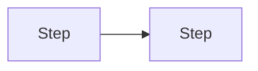

## Agent guardrails (read first)

- **Stop and ask the user** if requirements conflict, specs are ambiguous, or the next step would
need **substantial unplanned design** (new public surfaces, broad refactors) not covered here or in
linked zettels/ADRs.
- **Do not** expand scope silently or guess intent. **Do not assume** what the user meant—when in
doubt, **ask for guidance** and, if helpful, quote the unclear passage.
- **Prefer** small, reviewable steps. If review is on, halt at the boundaries in **Review policy**.

## Review policy

- **Stop after each todo / milestone**: yes / no
- **Who validates**: user / CI / both

## Scope

- **In scope**: …
- **Design links**: [[hub-or-topic.zettel]], ADRs (e.g. D-NNN), …

### Out of scope (planned non-goals)

Items **never** targeted by this plan from the start—not “later,” just not this phase’s goals.

- …

### Deferred work (postponed during implementation)

Items that were **in scope or surfaced as needed**, then **intentionally skipped** for now (tech debt,
follow-up refactors, etc.). Record **why** when non-obvious. May become deferred-work zettels
or queue items—**this is not the same as Out of scope** above.

- …

## Acceptance criteria

Definition of done: behavior, tests, compatibility, or other measurable outcomes.

- …

## Work breakdown

Freeform milestones; align with YAML `todos` (add more `milestone-`* todos above if the phase needs
several implementation steps). Do not assume a compiler pipeline unless this plan is actually about
that stack.

1. …
2. …

## Design notes (optional)

**Tips:**

- Prefer **algorithm sketches**, **pseudo-code**, or short **code snippets** when behavior is easy
to misunderstand.
- Add **diagrams** (e.g. Mermaid) for dependencies, sequences, or dataflow when they reduce risk.

## Risks, complications, and breaking changes

- **Risks / complications**: edge cases, integration surprises.
- **Breaking changes**: wire format, REST, behavior—list explicitly, or state **none intended**.

## Plan drift (optional)

If execution diverges from this file, bullet **what changed and why** (short paper trail).

## Verification (plan-specific)

Spell out **this phase’s** tests and commands. The generic close-out checklist lives in the workflow
meta zettel—see **Close-out** below.

- …

## Close-out

1. **Mechanical checklist** — Follow **[implementation-plan-workflow.meta.md](../../docs/design-space/zettels/implementation-plan-workflow.meta.md)**
   and **docs/AGENTS.md** (Implementation Plans): queue `[x]`, `thread.md`, session zettel when
   warranted, debug scripts, `current-state.md`, zettel tags/connections, `decisions.md` if new ADRs.

2. **Zettelkasten reconciliation (before calling the plan done)** — Review what actually shipped
   (code, tests, user-visible behavior) against **this plan**, **acceptance criteria**, and
   **Deferred work**. Compare to the design space: `current-state.md`, `decisions.md`, and every
   zettel the work touched or should have touched. **Call out discrepancies explicitly** (stale
   maturity tags, missing `Connections`, behavior that diverges from a zettel, ADRs not linked,
   docs that contradict code, etc.); do not silently ignore drift.

3. **New zettels** — List any **new** atomic notes that should exist (topics surfaced in
   implementation, deferred-work captures, splits from a hub, etc.). **Confirm with the user**
   which to create (and naming), then add them; do **not** bulk-create zettels without agreement.

Add **only non-obvious** mechanical bullets below (e.g. “extend `PiescriptIT` with scenario X”).

- …

## Design decisions (optional)

- **D-NNN**: …
- Pre-settled (zettels): …

## Appendix: scratch

Optional drafting notes; trim before treating the plan as final.