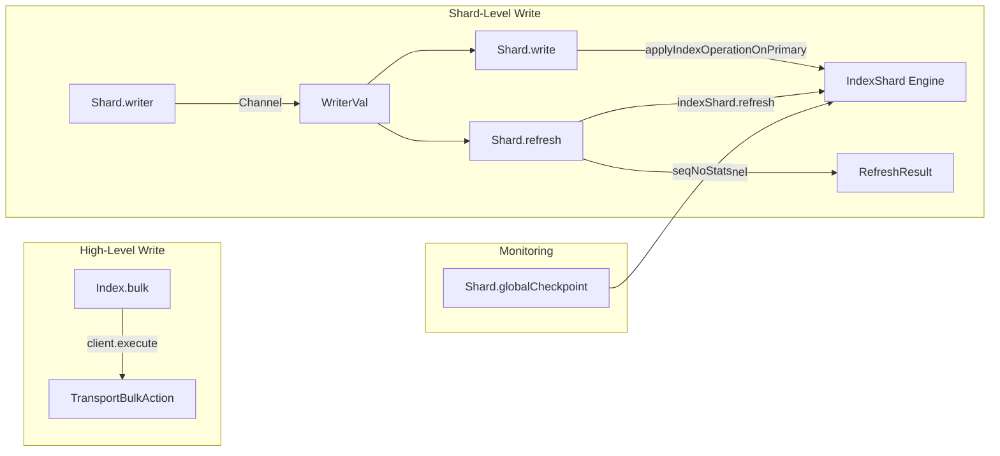

# Block E: Write Primitives Implementation Plan

## Architecture

Block E mirrors Block D (read primitives) with a write counterpart:



## Key Files

- **Values**: [Value.java](x-pack/plugin/piescript/src/main/java/org/elasticsearch/xpack/piescript/eval/Value.java) — add `WriterVal`
- **State**: new [WriterState.java](x-pack/plugin/piescript/src/main/java/org/elasticsearch/xpack/piescript/eval/WriterState.java) — holds `IndexShard` + `IndexService`
- **Evaluator**: new [EvalWrite.java](x-pack/plugin/piescript/src/main/java/org/elasticsearch/xpack/piescript/eval/EvalWrite.java) — `writer()`, `write()`, `refresh()`, `globalCheckpoint()`, `bulk()`
- **Dispatch**: [EvalBuiltins.java](x-pack/plugin/piescript/src/main/java/org/elasticsearch/xpack/piescript/eval/EvalBuiltins.java) — add cases for new builtins
- **Types**: [Prelude.java](x-pack/plugin/piescript/src/main/java/org/elasticsearch/xpack/piescript/elab/Prelude.java) — register type schemes
- **Elaborator**: [Elaborator.java](x-pack/plugin/piescript/src/main/java/org/elasticsearch/xpack/piescript/elab/Elaborator.java) — add `WRITER` type constructor
- **Serialization**: [ValueSerialization.java](x-pack/plugin/piescript/src/main/java/org/elasticsearch/xpack/piescript/eval/ValueSerialization.java) — reject `WriterVal`
- **Tests**: [PiescriptIT.java](x-pack/plugin/piescript/src/javaRestTest/java/org/elasticsearch/xpack/piescript/PiescriptIT.java), [PiescriptMultiNodeIT.java](x-pack/plugin/piescript/src/javaRestTest/java/org/elasticsearch/xpack/piescript/PiescriptMultiNodeIT.java)

## Sub-block E.1: Foundation (WriterVal, Writer type, RecordVal-to-XContent)

### WriterState + WriterVal

Create `WriterState.java` mirroring [SearcherState.java](x-pack/plugin/piescript/src/main/java/org/elasticsearch/xpack/piescript/eval/SearcherState.java) but simpler (no cursor/segments):

- Fields: `IndexShard indexShard`, `IndexService indexService`
- No mutable cursor state (each `Shard.write` is independent)

Add to `Value.java` sealed interface:

```java
record WriterVal(WriterState state) implements Value {}
```

### Writer type constructor

In `Elaborator.java`, add alongside existing `SEARCHER` / `DOCREF`:

```java
public static final MonoType.TCon WRITER = new MonoType.TCon("Writer");
```

In `Prelude.java`, add helper alongside `searcher()` / `docref()`:

```java
static MonoType.AppType writer(MonoType schema) {
    return new MonoType.AppType(Elaborator.WRITER, schema);
}
```

### RecordVal-to-XContent conversion

In `EvalWrite.java`, implement recursive conversion:

```java
static XContentBuilder recordToXContent(Value.RecordVal record) throws IOException
```

Handles: `DoubleVal` (whole numbers as longs for clean JSON), `KeywordVal`, `BooleanVal`, `NullVal`, `RecordVal` (nested object), `ListVal` (array). Non-convertible values (`ClosureVal`, `ChannelVal`, `SearcherVal`, `WriterVal`, etc.) throw `EvaluationException`.

### id extraction

In `EvalWrite.java`:

```java
static String extractId(Value.RecordVal record)
```

Returns the `_id` field value (as string) if present, otherwise `null` (ES auto-generates). Removes `_id` from the source fields before conversion.

### Serialization rejection

In `ValueSerialization.writeValue`, add:

```java
case Value.WriterVal ignored -> throw new IOException("WriterVal is not serializable (node-local only)");
```

No changes to `TypeSerialization` — `Writer` type constructor serializes generically via `TCon` + `AppType`.

## Sub-block E.2: Shard.writer + Shard.write

### Shard.writer

Type: `forall r. Index r -> ShardRecord -> Channel (Writer r)`

Implementation in `EvalWrite.writer()` — same pattern as `EvalShard.open()`:

1. Validate `deps.indicesService()` and `deps.clusterService()` are non-null
2. Create channel (`channelRegistry.nextChannelId()` + `SubscribableListener`)
3. On executor: resolve `IndexShard` via `IndicesService` (same as `EvalShard.doOpen`)
4. Validate shard is primary (`indexShard.routingEntry().primary()`) — fail with clear error if not
5. Wrap in `WriterState` + `WriterVal`, complete channel
6. Return `ChannelVal(localNodeId, channelId)` immediately

### Shard.write

Type: `forall r. Writer r -> r -> WriteResult`

Where `WriteResult = { seq_no: Double, version: Double, result: Keyword }`

Implementation in `EvalWrite.write()`:

1. Extract `WriterState` from `WriterVal`
2. Convert `RecordVal` argument to `SourceToParse` via `recordToXContent` + `_id` extraction
3. Call `indexShard.applyIndexOperationOnPrimary(Versions.MATCH_ANY, VersionType.INTERNAL, sourceToParse, UNASSIGNED_SEQ_NO, UNASSIGNED_PRIMARY_TERM, System.currentTimeMillis(), false)`
4. If result is `MAPPING_UPDATE_REQUIRED` — fail with `EvaluationException` (document for future: handle mapping updates)
5. If result is `FAILURE` — fail with `EvaluationException` wrapping the failure
6. Build `WriteResult` record from `Engine.IndexResult`: `seq_no`, `version`, `result` (CREATED/UPDATED/NOOP)
7. Return via listener

### Prelude registration

Add to `ARITY`:

- `entry("Shard.writer", 2)`
- `entry("Shard.write", 2)`

Add type schemes in `buildModule()`:

- `shardWriterScheme()`: `forall r. Index r -> ShardRecord -> Channel (Writer r)`
- `shardWriteScheme()`: `forall r. Writer r -> r -> WriteResult`

`WriteResult` type: use a concrete record type `{ seq_no: Double, version: Double, result: Keyword }` in the scheme (same pattern as how `ShardRecord` is a known record type).

### EvalBuiltins dispatch

Add cases:

```java
case "Shard.writer" -> EvalWrite.writer(eval, requireIndexVal(args.get(0), name), requireRecord(args.get(1), name), listener);
case "Shard.write" -> EvalWrite.write(requireWriterVal(args.get(0), name), requireRecord(args.get(1), name), listener);
```

Add `requireWriterVal` helper (same pattern as `requireSearcherVal`).

## Sub-block E.3: Shard.refresh + Shard.globalCheckpoint

### Shard.refresh

Type: `forall r. Writer r -> Channel RefreshResult`

Where `RefreshResult = { refreshed: Boolean }`

Implementation in `EvalWrite.refresh()` — same async channel pattern as `Shard.writer` and `Shard.open`:

1. Create channel (`channelRegistry.nextChannelId()` + `SubscribableListener`)
2. On executor: call `writerState.indexShard.refresh("piescript")`
3. Build `RefreshResult` record from `Engine.RefreshResult` (whether a new searcher was opened or the refresh was a no-op)
4. Complete channel with result
5. Return `ChannelVal(localNodeId, channelId)` immediately

The channel return means the user synchronizes on refresh completion via `when` before reading, guaranteeing write-then-read visibility:

```
let refresh_ch = Shard.refresh writer;
when (refresh_ch ack) ->
  let reader_ch = Shard.open idx shard { match_all: true };
  when (reader_ch searcher) -> ...
```

This also aligns with the future linearity story: the `RefreshResult` could be a linear value required to open a post-write searcher.

### Shard.globalCheckpoint

Type: `forall r. Index r -> ShardRecord -> Double`

Implementation:

1. Resolve `IndexShard` from `IndicesService` (same pattern as `Shard.writer`)
2. Call `indexShard.seqNoStats().getGlobalCheckpoint()`
3. Return `DoubleVal(globalCheckpoint)`

Synchronous. Does NOT require a `WriterVal` — works on any shard (read or write context). This lets the user monitor replication progress independently of writing.

### Prelude registration

Add to `ARITY`:

- `entry("Shard.refresh", 1)`
- `entry("Shard.globalCheckpoint", 2)`

Add type schemes in `buildModule()`:

- `shardRefreshScheme()`: `forall r. Writer r -> Channel RefreshResult` where `RefreshResult = { refreshed: Boolean }`
- `shardGlobalCheckpointScheme()`: `forall r. Index r -> ShardRecord -> Double`

### EvalBuiltins dispatch

Add cases for both.

## Sub-block E.4: Index.bulk (High-Level Bulk API)

### Type

`forall r. Keyword -> List r -> Channel BulkResult`

Where `BulkResult = { total: Double, written: Double, failed: Double }`

### Implementation in EvalWrite.bulk()

1. Create channel (same pattern as `Shard.writer`)
2. On executor:

- Extract index name from `KeywordVal`
- Iterate `ListVal` elements, convert each `RecordVal` to `IndexRequest`:
  - `recordToXContent` for the source
  - `extractId` for the doc ID (null = auto-generate)
  - `new IndexRequest(indexName).id(id).source(builder)`
- Build `BulkRequest`, add all `IndexRequest`s
- Execute via `deps.client().execute(TransportBulkAction.TYPE, bulkRequest, bulkListener)`
- In `bulkListener.onResponse`: count successes/failures, build `BulkResult` record
- Complete channel with result

1. Return `ChannelVal` immediately

### Prelude registration

Add `entry("Index.bulk", 2)` to `ARITY`. Add type scheme in `buildModule()`.

### EvalBuiltins dispatch

Add `case "Index.bulk" ->` dispatching to `EvalWrite.bulk()`.

## Sub-block E.5: Tests + Documentation

### Unit tests

**EvalWrite tests** (new file `EvalWriteTests.java` or add to `EvaluatorTests.java`):

- `recordToXContent` for all Value types (double, keyword, boolean, null, nested record, list)
- `recordToXContent` rejects non-convertible values (ClosureVal, ChannelVal)
- `_id` extraction and removal
- Whole-number doubles serialize as integers in JSON

**Elaborator tests** (in `ElaboratorTests.java`):

- `Shard.writer` type inference: `use "idx" as idx; Shard.writer idx (List.head (Index.shards idx))`
- `Shard.write` type inference: produces `WriteResult` record
- `Shard.refresh` and `Shard.globalCheckpoint` type inference

**Serialization tests**:

- `WriterVal` throws `IOException` on serialization attempt (add to existing serialization test class)

### Integration tests (PiescriptIT.java)

- `testShardWriterAndWrite`: `use` source index, read docs via `Shard.open`/`consume`/`read`, transform, `use` dest index, acquire `Shard.writer`, `Shard.write` each record, `Shard.refresh`, then `Shard.open` dest and verify data
- `testShardWriteWithId`: write records with `_id` field, verify idempotent re-writes
- `testIndexBulk`: write records via `Index.bulk "dest" records`, verify via `query \`FROM dest`
- `testWriterValNotSerializableInResponse`: return `WriterVal` from program, expect 400+
- `testShardGlobalCheckpoint`: write, then read global checkpoint, verify >= 0

### Multi-node integration tests (PiescriptMultiNodeIT.java)

- `testRemoteShardWrite`: ship closure to data node, `Shard.writer` + `Shard.write` on primary shard, send `WriteResult` back via channel
- `testWriterValNotSerializableOverWire`: attempt to send `WriterVal` via channel to another node, expect failure

### Documentation

- **D-051 decision doc** in `decisions.md`: captures the design discussion — ES write primitives, two-tier architecture, primary-only shard writes, known bypasses (replication, ingest, indexing pressure), future directions (monadic write description, linearity, Painless push-down, cross-shard coordination)
- **Update `roadmap.md`**: mark Block E sub-blocks with status
- **Update `current-state.md`**: add write primitives to "What Works" table

## Known Bypasses (document in D-051)

These are explicitly deferred, not forgotten:

- **Replication**: Shard-level writes are primary-only. Replicas catch up via translog (ES background). User monitors via `Shard.globalCheckpoint`. Future: linearity (Phase 6) enforces write-then-replicate protocol.
- **Indexing pressure**: Shard-level writes bypass `IndexingPressure`. Future: integrate pressure tracking into `WriterState` lifecycle.
- **Ingest pipelines**: Shard-level writes skip ingest. `Index.bulk` runs default pipelines. Future: `WriteContext` surfaces pipeline handles as first-class values.
- **Mapping updates**: `MAPPING_UPDATE_REQUIRED` from Engine causes failure. Future: handle mapping updates or require strict mappings.
- `**List.map` is semantically `traverse`: Effects are sequenced correctly but the combinator name is misleading. Future: proper `List.traverse` / `mapM`.
- **Monadic write description**: Full CPS/session-typed write pipeline is future work, gated on linearity.
- **Painless push-down for updates**: `Write.update` compiled to Painless via closure conversion. Future work.
- **Security pre-check**: `HasPrivilegesAction` during elaboration for write targets. Future work.
- **Cross-shard coordination patterns**: Saga-style multi-shard writes. Already possible with channels + Block E, but no built-in support.

## Test data setup

The existing `piescript-typed` test index (used by Block D tests) has 3 documents with `name`, `age`, `active` fields. For write tests, we need a destination index. Two approaches:

- Use `Index.bulk` to write to a new index (auto-created) and verify
- Pre-create a `piescript-write-dest` index in test setup with known mappings for `Shard.writer` tests (since shard-level writes require `use` which requires the index to exist)
