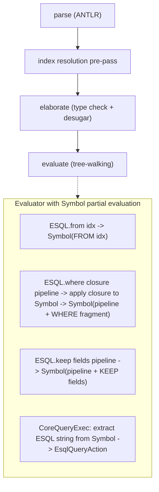

# Block F: T-LINQ ESQL Query (Language-Integrated Query)

**Prerequisite**: D-050 (`RowType` as first-class `MonoType`) must be completed first so that
row type variables `r` and `s` in `ESQL r` have `Kind.ROW`.

D-052 decision document should be written before implementation, capturing the full design
rationale.

## Architecture

**Revised during implementation**: the original plan called for an `EsqlPlan` ADT + `EsqlCompiler`
that walks `ClosureVal(body, env)` Core IR. This was replaced with an NbE-style (Normalization by
Evaluation) approach using `Value.Symbol(String esql)`. The ESQL string is built incrementally
during evaluation — no separate plan ADT, no Core IR walking, no separate compiler.

**How it works**: ESQL. builtins partially evaluate closure arguments by calling
`applyFunction(closure, Symbol(""), listener)` — passing a symbolic row value. The evaluator
runs normally: let-bindings reduce, lambda applications reduce, arithmetic on concrete values
reduces. Operations that depend on the symbolic row get stuck:

- `CoreProject` on a `Symbol` produces `Symbol(fieldName)` — a field reference
- `CorePrimOp` with any `Symbol` operand compiles all operands to ESQL fragments and produces
`Symbol("(left OP right)")` — a compiled expression
- Concrete values compile to ESQL literals inline

This is the NbE pattern: evaluate into a semantic domain (`Value` + `Symbol` for stuck terms),
where the "read-back" into the target syntax (ESQL) happens inline as terms get stuck. The
`Symbol` IS the neutral form — the irreducible residual compiled to ESQL. It is also, in spirit,
a free monad description: `Symbol` accumulates a description of the ESQL computation that gets
interpreted at the `query ... ;` boundary.

**Rationale for the change**: The original `EsqlCompiler` walked Core IR directly (`CoreExpr` in
the closure body), duplicating evaluation logic and handling inline literals separately from
captured values. Worse, it couldn't handle let-bindings, lambda applications, or projections on
non-row records inside closure bodies — it was ad-hoc pattern matching on Core IR instead of
principled partial evaluation. The NbE approach reuses the existing evaluator for normalization,
handles all expression forms correctly, and produces ESQL strings with no Core IR walking.




No `EsqlPlan`, no `EsqlPlanVal`, no `EsqlCompiler`, no Core IR walking. The evaluator IS the
compiler. `Symbol(String)` is the only new Value variant.

## Design principles

1. **1:1 ESQL command mapping** — each piescript combinator maps to exactly one ESQL processing
  command. No ad-hoc pattern matching on lambda bodies to decide which ESQL command to emit.
2. **NbE-style partial evaluation** — closures are evaluated with a `Symbol("")` row. The
  evaluator reduces everything it can; operations on symbolic values produce `Symbol(esqlFragment)`.
   No separate compiler, no Core IR walking. The evaluator IS the compiler.
3. `**Symbol(String)` is the only new Value variant — replaces `EsqlPlan`, `EsqlPlanVal`, and
  `EsqlCompiler`. Non-serializable, ephemeral. Carries the compiled ESQL string.
4. **Two type vars for schema-changing combinators** — `forall (r : Row) (s : Row)` where `s` is
  fresh and constrained by downstream usage. The `r → s` relationship (subset, extension) is
   unencoded for now; future work with Lacks constraints / typeclasses.
5. `**query ... ;` IS the boundary — no `ESQL.run`. The delimiters quote and materialize.
6. **Old `query` backtick syntax removed** — replaced entirely, not kept as escape hatch.

## Type signatures

Lambdas take `Record r` (a record value with projectable fields), not bare `r` (a row schema).
`ESQL r` carries the row schema; `Record r` is the value type.

### Schema-preserving (one row type var):

```
ESQL.from     : forall (r : Row). Index r -> ESQL r
ESQL.where    : forall (r : Row). (Record r -> Boolean) -> ESQL r -> ESQL r
ESQL.limit    : forall (r : Row). Double -> ESQL r -> ESQL r
ESQL.sort     : forall (r : Row) (a : Type). (Record r -> a) -> ESQL r -> ESQL r
ESQL.sortDesc : forall (r : Row) (a : Type). (Record r -> a) -> ESQL r -> ESQL r
ESQL.explain  : forall (r : Row). ESQL r -> Keyword
```

### Schema-changing (two row type vars):

```
ESQL.eval     : forall (r : Row) (s : Row). (Record r -> Record s) -> ESQL r -> ESQL s
ESQL.keep     : forall (r : Row) (s : Row). List Keyword -> ESQL r -> ESQL s
ESQL.drop     : forall (r : Row) (s : Row). List Keyword -> ESQL r -> ESQL s
ESQL.rename   : forall (r : Row) (s : Row). List { from: Keyword, to: Keyword } -> ESQL r -> ESQL s
```

## ESQL command mapping

| Piescript combinator | ESQL command    | Argument                 | Compiles to                               |
| -------------------- | --------------- | ------------------------ | ----------------------------------------- | --------------------------------- |
| `ESQL.from`          | `FROM`          | `Index r`                | `FROM <index_name>`                       |
| `ESQL.where`         | `WHERE`         | `(Record r -> Boolean)`  |                                          `| WHERE <compiled_predicate>`       |
| `ESQL.eval`          | `EVAL`          | `(Record r -> Record s)` |                                          `| EVAL f1 = expr1, f2 = expr2, ...` |
| `ESQL.keep`          | `KEEP`          | `List Keyword`           |                                          `| KEEP f1, f2, ...`                 |
| `ESQL.drop`          | `DROP`          | `List Keyword`           |                                          `| DROP f1, f2, ...`                 |
| `ESQL.limit`         | `LIMIT`         | `Double`                 |                                          `| LIMIT n`                          |
| `ESQL.sort`          | `SORT ... ASC`  | `(Record r -> a)`        |                                          `| SORT field ASC`                   |
| `ESQL.sortDesc`      | `SORT ... DESC` | `(Record r -> a)`        |                                          `| SORT field DESC`                  |
| `ESQL.rename`        | `RENAME`        | rename mapping           |                                          `| RENAME old AS new, ...`           |
| `ESQL.explain`       | (debug)         | `ESQL r`                 | returns compiled ESQL string as `Keyword` |

## Components

### F.1 — Type system: `ESQL r` type constructor + Prelude builtins

**Depends on**: D-050 (RowType as first-class MonoType)

- Add `ESQL` to `Elaborator.KNOWN_TYPES` as `TCon("ESQL")`
- Add type schemes to [Prelude.java](x-pack/plugin/piescript/src/main/java/org/elasticsearch/xpack/piescript/elab/Prelude.java)
using the signatures above. Two-type-var schemes use two pre-allocated `Rigid` IDs.
- Add arities to `Prelude.ARITY` for all MVP ESQL. builtins.
- Add `CoreQueryExec` to the `CoreExpr` sealed hierarchy (18th variant). Wraps the inner
expression (an `ESQL r` plan). Type is `List (Record r)` — the materialized result.

### F.2 — Grammar: `query expr ;` syntax (replaces old `query` backtick)

**Lexer** ([PiescriptLexer.g4](x-pack/plugin/piescript/src/main/antlr/PiescriptLexer.g4)):

- Change `QUERY : 'query' -> pushMode(ESQL_MODE);` to just `QUERY : 'query';`
- Delete the entire `ESQL_MODE` mode (`ESQL_BODY`, `ESQL_WS` rules)

**Parser** ([PiescriptAntlrParser.g4](x-pack/plugin/piescript/src/main/antlr/PiescriptAntlrParser.g4)):

- Replace `| QUERY ESQL_BODY  # QueryExpr` with:

```
| QUERY expr SEMICOLON               # QueryExpr
```

No ambiguity: `SEMICOLON` cannot appear inside an `expr` outside of braces.

**Elaboration** — `QueryExpr` elaborates as:

```java
case PiescriptAntlrParser.QueryExprContext q -> {
    var inner = elaborate(q.expr(), ctx);
    var rowMeta = state.freshRow(ctx.bindingLevel());
    var esqlType = new MonoType.AppType(ESQL, rowMeta);
    emitConstraint(inner.type(), esqlType, source(q));
    var recordType = new MonoType.RecordType(rowMeta);
    var resultType = new MonoType.AppType(LIST, recordType);
    yield new CoreQueryExec(source(q).source(), inner, resultType);
}
```

**Remove**: `Queries.java`, `EsqlBodyParser.java` (opaque ESQL body parsing no longer needed).
`IndexResolutionPrePass` continues to resolve `use` declarations; query index patterns now come
from `ESQL.from`'s `Index r` argument (already resolved by `use`).

User writes:

```
use "logs-*" as logs;
query
  ESQL.from logs
    |> ESQL.where (fn r -> r.status == "active")
    |> ESQL.keep ["name", "status"];
```

### F.3 — `EsqlPlan` sealed interface + `EsqlPlanVal` wrapper

New sealed interface `EsqlPlan` in `piescript.eval` (separate from `Value`):

```java
public sealed interface EsqlPlan {
    record From(Value.IndexVal index) implements EsqlPlan {}
    record Where(Value.ClosureVal predicate, EsqlPlan source) implements EsqlPlan {}
    record Eval(Value.ClosureVal projection, EsqlPlan source) implements EsqlPlan {}
    record Keep(List<String> fields, EsqlPlan source) implements EsqlPlan {}
    record Drop(List<String> fields, EsqlPlan source) implements EsqlPlan {}
    record Limit(int count, EsqlPlan source) implements EsqlPlan {}
    record Sort(Value.ClosureVal keyFn, boolean descending, EsqlPlan source) implements EsqlPlan {}
    record Rename(Map<String, String> mapping, EsqlPlan source) implements EsqlPlan {}
}
```

New `Value` variant — thin wrapper, non-serializable:

```java
record EsqlPlanVal(EsqlPlan plan) implements Value {}
```

`ValueSerialization`: `EsqlPlanVal` throws `IOException` on serialization (same as `SearcherVal`,
`WriterVal`, `DocRefVal`). `EsqlPlanVal` is ephemeral — built during evaluation, compiled to
ESQL, discarded.

### F.4 — Evaluator: ESQL. builtin handlers + CoreQueryExec

**EvalBuiltins** — add cases for all ESQL. builtins:

```java
case "ESQL.from" -> {
    var idx = requireIndexVal(args.get(0), name);
    listener.onResponse(new Value.EsqlPlanVal(new EsqlPlan.From(idx)));
}
case "ESQL.where" -> {
    var pred = requireClosure(args.get(0), name);
    var plan = requireEsqlPlan(args.get(1), name);
    listener.onResponse(new Value.EsqlPlanVal(new EsqlPlan.Where(pred, plan)));
}
case "ESQL.eval" -> {
    var proj = requireClosure(args.get(0), name);
    var plan = requireEsqlPlan(args.get(1), name);
    listener.onResponse(new Value.EsqlPlanVal(new EsqlPlan.Eval(proj, plan)));
}
case "ESQL.keep" -> {
    var fields = requireList(args.get(0), name).elements().stream()
        .map(v -> ((Value.KeywordVal) v).value()).toList();
    var plan = requireEsqlPlan(args.get(1), name);
    listener.onResponse(new Value.EsqlPlanVal(new EsqlPlan.Keep(fields, plan)));
}
// ... similar for drop, limit, sort, sortDesc, rename
```

**Evaluator** — add `CoreQueryExec` case:

```java
case CoreQueryExec q -> evaluate(q.expr(), env, listener.delegateFailureAndWrap((l, planVal) -> {
    var plan = ((Value.EsqlPlanVal) planVal).plan();
    var esqlString = EsqlCompiler.compile(plan);
    var request = EsqlQueryRequest.syncEsqlQueryRequest(esqlString);
    deps.client().execute(EsqlQueryAction.INSTANCE, request,
        l.delegateFailureAndWrap((l2, response) ->
            l2.onResponse(EsqlValueConverter.convertResponse(response))));
}));
```

**ESQL.explain** — same path but returns the string instead of executing:

```java
case "ESQL.explain" -> {
    var plan = requireEsqlPlan(args.get(0), name);
    listener.onResponse(new Value.KeywordVal(EsqlCompiler.compile(plan)));
}
```

### F.5 — ESQL compiler: `EsqlCompiler`

New class `EsqlCompiler` in `piescript.eval`.

**Entry point**: `static String compile(EsqlPlan plan)` — walks the plan and assembles an ESQL
pipeline string.

**Plan compilation** (recursive, inside-out):

- `From(idx)` -> `FROM <idx.name()>`
- `Where(pred, source)` -> `compile(source) | WHERE <compileExpr(pred)>`
- `Eval(proj, source)` -> `compile(source) | EVAL <compileEvalFields(proj)>`
- `Keep(fields, source)` -> `compile(source) | KEEP <fields joined by comma>`
- `Drop(fields, source)` -> `compile(source) | DROP <fields joined by comma>`
- `Limit(n, source)` -> `compile(source) | LIMIT n`
- `Sort(keyFn, desc, source)` -> `compile(source) | SORT <compileFieldAccess(keyFn)> [DESC]`
- `Rename(mapping, source)` -> `compile(source) | RENAME <old AS new, ...>`

**Expression compilation** — `compileExpr(ClosureVal closure)`:

The compiler walks `closure.body()` (a `CoreExpr`), using `closure.env()` for variable
resolution. `CoreVar(0)` is the row parameter (compiles to field references). `CoreVar(n > 0)`
looks up `env[n-1]` and inlines the value as an ESQL literal. No substitutions, no shifting.


| CoreExpr in closure body                  | ESQL output                                    |
| ----------------------------------------- | ---------------------------------------------- |
| `CoreProject(CoreVar(0), "field")`        | `field`                                        |
| `CorePrimOp(EQ, [a, b])`                  | `a == b`                                       |
| `CorePrimOp(AND, [a, b])`                 | `a AND b`                                      |
| `CorePrimOp(OR, [a, b])`                  | `a OR b`                                       |
| `CorePrimOp(NOT, [a])`                    | `NOT a`                                        |
| `CorePrimOp(GT/LT/GTE/LTE, [a, b])`       | `a > b` etc.                                   |
| `CorePrimOp(ADD/SUB/MUL/DIV/MOD, [a, b])` | `a + b` etc.                                   |
| `CorePrimOp(NEG, [a])`                    | `-a`                                           |
| `CoreLit(DoubleLit(v))`                   | number literal                                 |
| `CoreLit(KeywordLit(v))`                  | `"string"`                                     |
| `CoreLit(BooleanLit(v))`                  | `true` / `false`                               |
| `CoreLit(NullLit)`                        | `null`                                         |
| `CoreVar(n > 0)`                          | `env[n-1]` inlined as literal                  |
| `CoreTypeAbs` / `CoreTypeApp`             | erase (pass through to child)                  |
| Anything else                             | error: `"cannot compile to ESQL: <node kind>"` |


**EVAL field compilation** — `compileEvalFields(ClosureVal closure)`:

Walk the `CoreRecord` in the closure body. For each `label: expr`, compile `expr` to an ESQL
expression and emit `label = compiled_expr`. Result: `f1 = expr1, f2 = expr2, ...`.

### F.6 — Serialization

- `EsqlPlanVal` throws `IOException` on serialization (non-serializable, ephemeral)
- `CoreQueryExec` added to `CoreExprSerialization` (18th variant)
- Closures containing `query ... ;` blocks serialize normally — `CoreQueryExec` is part of the
`CoreExpr` tree, plan is built at evaluation time on whichever node runs the query

### F.7 — Tests

**Unit tests — `EsqlCompilerTests`**:

- Predicate compilation: field access, all comparison/boolean/arithmetic operators, string/number/boolean literals
- Captured variable inlining via env: `let t = 18.0 in ESQL.where (fn r -> r.age > t)` -> `WHERE age > 18.0`
- EVAL field compilation: `fn r -> { total: r.price * r.qty }` -> `EVAL total = price * qty`
- Type erasure: CoreTypeAbs/CoreTypeApp erased during compilation
- Error cases: non-compilable CoreExpr kinds produce clear errors

**Unit tests — `ElaboratorTests` additions**:

- `ESQL.from idx` has type `ESQL r` where `r` matches the index schema
- `ESQL.where (fn r -> r.age > 18.0) q` preserves the row type
- `ESQL.eval (fn r -> { total: r.price * r.qty }) q` produces `ESQL s` (fresh `s`)
- `ESQL.keep ["name"] q` produces `ESQL s` (fresh `s`, constrained by downstream usage)
- Type errors: wrong predicate return type, wrong argument types

**Unit tests — `EvaluatorTests` additions**:

- `ESQL.from` produces `EsqlPlanVal(From(...))`
- `ESQL.where pred (ESQL.from idx)` produces `EsqlPlanVal(Where(pred, From(...)))`
- Plan chaining builds correct nested structure
- `ESQL.explain` returns compiled ESQL string

**Integration tests — `PiescriptIT` additions**:

- End-to-end: `query ESQL.from logs |> ESQL.where (fn r -> r.status == "active") |> ESQL.keep ["name", "status"];`
- `ESQL.explain` returns correct ESQL string
- Captured variable: `let t = "active" in query ESQL.from logs |> ESQL.where (fn r -> r.status == t);`
- ESQL.eval + ESQL.keep pipeline
- ESQL.sort / ESQL.sortDesc
- ESQL.limit
- ESQL.stats with aggregate builtins (if in MVP)

## Scope boundaries

**In scope (this block)**:

- D-050 prerequisite (RowType as first-class MonoType)
- `ESQL r` type constructor
- `query expr ;` syntax (replaces old `query` backtick syntax entirely)
- MVP combinators: `ESQL.from`, `ESQL.where`, `ESQL.eval`, `ESQL.keep`, `ESQL.drop`,
`ESQL.limit`, `ESQL.sort`, `ESQL.sortDesc`, `ESQL.rename`
- `ESQL.explain` for debugging
- `Value.Symbol(String)` — NbE neutral for ESQL string accumulation (replaces EsqlPlan/EsqlCompiler)
- `CoreQueryExec` Core IR node

**Known gaps (documented tech debt)**:

- `ESQL.keep` and `ESQL.drop` take `List Keyword` (runtime strings), not closures. Field names
are not validated against the row type at elaboration time — ESQL validates at execution time.
The typed path for column selection is `ESQL.eval` (closure-based, goes through the type
checker). Future: row-level constraints or a closure-based `ESQL.keep` variant.
- `ESQL.rename` similarly takes string pairs, not type-checked field references.

**Out of scope (future, documented)**:

- `ESQL.stats` + aggregate builtins — design direction: `Agg a` typed aggregate descriptors
passed as a record (e.g., `{ count: ESQL.count, avg_salary: ESQL.avg "salary" }` where
`ESQL.count : Agg Double`, `ESQL.avg : Keyword -> Agg Double`). Record field names become
output column names. `Agg a` is polymorphic in its result type. Full design TBD — STATS is
the most complex ESQL command (optional BY, multiple BY expressions, per-aggregate WHERE
filters, computed grouping keys) and deserves its own focused session.
- Comprehension syntax (`from r in idx where ... select ...`) — sugar over combinators
- `ESQL.join` (LOOKUP JOIN) — complex cross-index typing
- `ESQL.enrich` / `ESQL.dissect` / `ESQL.grok` — complex or hard to type
- Internal ESQL `LogicalPlan` compilation (bypass string, construct plan nodes directly) — deeper
integration, enables arbitrary lambda compilation to ESQL expressions
- `Queryable` typeclass abstraction over ESQL / ShardPlan / List backends
- Row constraints (Lacks, typeclasses) to encode `r -> s` relationship for keep/drop/eval
- Runtime normalization for dynamic query composition
- `Liftable` kind constraint for ESQL-compilable types

