# Block G — Streaming Data Access via Compute Engine

## Context

Piescript's current read path (`Shard.open` / `consume` / `read`) works doc-by-doc: `consume` produces `DocRefVal`s, `read` converts one DocRef into one `RecordVal`. Everything materializes eagerly into `List<Value>` on the coordinator. This does not scale — large result sets OOM, and there is no backpressure or batching.

ESQL's compute engine (`x-pack/plugin/esql/compute/`) provides the missing infrastructure: columnar Pages, batched BlockLoader reads from Lucene, and the Exchange system for streaming Pages between nodes with bounded buffers and backpressure.

The integration keeps piescript's philosophy: **the user explicitly controls** how data is read, streamed, and materialized. No magic — just new builtins that expose compute engine primitives as composable piescript values.

## Decision Record (D-053)

A new decision record in [decisions.md](x-pack/plugin/piescript/docs/decisions.md) covering:

- **Streaming model**: `Shard.open` / `consume` remain as-is. A new `Shard.stream` builtin (or `Shard.readPage`) replaces `Shard.read` for the columnar path. `Shard.read` is retained for single-doc access.
- **Page as opaque type**: `Page r` is a non-serializable, node-local opaque type (like `Searcher r`). The row parameter `r` from `Index r` / `Searcher r` carries through. Pages are the unit of Exchange transport — their internal Block structure is not exposed to the user (for now).
- **Exchange as user-orchestrated infrastructure**: Exchange builtins are individual primitives the user composes, following D-042. The user creates handlers, connects sinks/sources, and polls pages. Libraries may wrap higher-level patterns.
- **Materialization is explicit**: `Page.toList` converts a Page to `List r` (piescript Values). The user chooses where this happens — data node (compute locally, ship Values) or coordinator (ship Pages, materialize at the edge).
- **Future: bytecode compilation of pure piescript**: The kind system separates pure from effectful (`Local`) code. All pure lambdas are candidates for compilation to bytecode over typed arrays, eliminating the boxing overhead at the materialization boundary. This is not ad-hoc AST matching or a delimited compilation region — it is whole-pure-fragment compilation, using the same pipeline regardless of what the lambda operates on.

## Architecture

```mermaid
graph LR
    subgraph DataNode [Data Node]
        Open["Shard.open"] --> Searcher["Searcher r"]
        Searcher --> Consume["Shard.consume N"]
        Consume --> DocRefs["List DocRef r"]
        DocRefs --> Stream["Shard.stream fields"]
        Stream --> PageVal["Page r"]
        PageVal --> ExSink["Exchange.addPage sink page"]
    end

    subgraph Transport [Exchange Transport]
        ExSink --> ExchangeInfra["Exchange backpressure + buffering"]
    end

    subgraph Coordinator [Coordinator]
        ExchangeInfra --> ExSource["Exchange.poll source"]
        ExSource --> PageVal2["Page r"]
        PageVal2 --> Materialize["Page.toList page"]
        Materialize --> ListVal["List r (Values)"]
    end
```



## Naming Scheme

Builtins follow the existing qualified naming pattern:

| Namespace  | Builtin            | Signature (conceptual)                                 | Purpose                                                       |
| ---------- | ------------------ | ------------------------------------------------------ | ------------------------------------------------------------- |
| `Shard`    | `Shard.stream`     | `Searcher r -> List (DocRef r) -> Page r`              | Convert a batch of DocRefs to a columnar Page via BlockLoader |
| `Exchange` | `Exchange.create`  | `Double -> Channel { sink: Sink r, source: Source r }` | Create a same-node exchange (DirectExchange) with buffer size |
| `Exchange` | `Exchange.addPage` | `Sink r -> Page r -> ()`                               | Push a Page into an exchange sink                             |
| `Exchange` | `Exchange.poll`    | `Source r -> Channel (Page r)`                         | Pull a Page from an exchange source (async, backpressure)     |
| `Exchange` | `Exchange.finish`  | `Sink r -> ()`                                         | Signal no more pages from this sink                           |
| `Exchange` | `Exchange.done`    | `Source r -> Boolean`                                  | Check if source is exhausted                                  |
| `Page`     | `Page.toList`      | `Page r -> List r`                                     | Materialize a Page into piescript Values                      |
| `Page`     | `Page.count`       | `Page r -> Double`                                     | Number of rows in a Page                                      |

Remote exchange builtins (for cross-node streaming):

| Namespace  | Builtin                  | Signature (conceptual)                    | Purpose                                                            |
| ---------- | ------------------------ | ----------------------------------------- | ------------------------------------------------------------------ |
| `Exchange` | `Exchange.openSink`      | `Node -> Keyword -> Double -> Channel ()` | Create a sink handler on a remote node (exchangeId + bufferSize)   |
| `Exchange` | `Exchange.connectSource` | `Keyword -> Node -> Double -> Source r`   | Connect a local source to a remote sink (exchangeId + concurrency) |

## Implementation Steps

### Step 1: Gradle dependency + new Value types

- Add `x-pack:plugin:esql:compute` as a compile dependency for the piescript plugin.
- Add new `Value` variants: `PageVal(Page, List<String> columnNames)`, `ExchangeSinkVal(ExchangeSink)`, `ExchangeSourceVal(ExchangeSource)`. All non-serializable and node-local (like `SearcherVal`).
- Add `Page r`, `Sink r`, `Source r` type constructors to the type system (Prelude + elaboration).

### Step 2: `Shard.stream` — DocRefs to Page via BlockLoader

New builtin in [EvalShard.java](x-pack/plugin/piescript/src/main/java/org/elasticsearch/xpack/piescript/eval/EvalShard.java).

Takes a `Searcher r` and a `List (DocRef r)`. Implementation:

1. Build a `DocVector` (shard index, leaf ordinals, doc IDs) from the DocRefVals — they already carry `LeafReaderContext` and `docId`.
2. For each mapped field in `r`, get `MappedFieldType` from `SearcherState.indexService.mapperService()`, call `blockLoader(context)` to get a `BlockLoader`, use `ColumnAtATimeReader` or `RowStrideReader` to load values into Blocks.
3. Assemble Blocks into a `Page`.
4. Return `PageVal(page, columnNames)`.

This reuses the same `BlockLoader` infrastructure ESQL uses in `ValuesSourceReaderOperator` — same I/O path, zero overhead vs ESQL.

Key classes to reference:

- [BlockLoader.java](server/src/main/java/org/elasticsearch/index/mapper/BlockLoader.java) — the interface each field type implements
- [ValuesSourceReaderOperator.java](x-pack/plugin/esql/compute/src/main/java/org/elasticsearch/compute/lucene/read/ValuesSourceReaderOperator.java) — ESQL's implementation to learn from

### Step 3: `Page.toList` / `Page.count` — materialization builtins

New class `EvalPage.java`. `Page.toList` iterates positions in the Page, reads each Block at each position, converts to piescript Values (`DoubleVal`, `KeywordVal`, etc.), and produces `ListVal(List<RecordVal>)`. Similar to what `EsqlValueConverter` does but for compute `Page` objects.

### Step 4: `Exchange.create` / `addPage` / `poll` / `finish` / `done` — same-node exchange

New class `EvalExchange.java`. Uses `DirectExchange(bufferSize)` for same-node pipes.

- `Exchange.create` → creates `DirectExchange`, wraps sink and source in `ExchangeSinkVal` / `ExchangeSourceVal`, returns them via a channel as a record.
- `Exchange.addPage` → `sink.addPage(page)`. Synchronous push (blocks via `waitForWriting` if buffer full — need to integrate with piescript's async model via `ActionListener`).
- `Exchange.poll` → `source.pollPage()`. Returns via channel (async, uses `waitForReading`).
- `Exchange.finish` → `sink.finish()`.
- `Exchange.done` → `source.isFinished()`.

### Step 5: Remote exchange builtins

Requires `ExchangeService` access. Either inject ESQL's instance or create piescript's own.

- `Exchange.openSink` → `ExchangeService.openExchange(...)` on a remote node.
- `Exchange.connectSource` → creates `ExchangeSourceHandler`, calls `addRemoteSink(exchangeService.newRemoteSink(...))`, returns the `ExchangeSource`.

### Step 6: Prelude, elaboration, serialization

- Register all new types and builtins in [Prelude.java](x-pack/plugin/piescript/src/main/java/org/elasticsearch/xpack/piescript/elab/Prelude.java): type schemes for `Shard.stream`, `Page.toList`, `Page.count`, `Exchange.create`, `Exchange.addPage`, `Exchange.poll`, `Exchange.finish`, `Exchange.done`, `Exchange.openSink`, `Exchange.connectSource`. Arities in `ARITY` map.
- Add `Page r`, `Sink r`, `Source r` type constructors (`AppType(TCon("Page"), r)`, etc.) and kind checks in elaboration.
- Ensure `PageVal` / `ExchangeSinkVal` / `ExchangeSourceVal` throw on serialization (same pattern as `SearcherVal` in [ValueSerialization.java](x-pack/plugin/piescript/src/main/java/org/elasticsearch/xpack/piescript/eval/ValueSerialization.java)).

### Step 7: Unit tests

In [EvaluatorTests.java](x-pack/plugin/piescript/src/test/java/org/elasticsearch/xpack/piescript/eval/EvaluatorTests.java) (follows existing patterns — uses `DIRECT_EXECUTOR_SERVICE` for deterministic tests):

- `Shard.stream` produces a `PageVal` from a list of `DocRefVal`s
- `Page.toList` converts a `PageVal` to `ListVal(List<RecordVal>)` with correct field names and typed values
- `Page.count` returns the position count as `DoubleVal`
- `Exchange.create` returns a record with `sink` and `source` fields
- `Exchange.addPage` + `Exchange.poll` round-trip: push page into sink, poll from source, verify same data
- `Exchange.finish` + `Exchange.done`: finish sink, verify source reports done
- Backpressure: `Exchange.poll` on empty source returns via async channel (not immediate)

In [ElaboratorTests.java](x-pack/plugin/piescript/src/test/java/org/elasticsearch/xpack/piescript/elab/ElaboratorTests.java):

- Type inference for `Shard.stream` — `Searcher r → List (DocRef r) → Page r`
- Type inference for `Page.toList` — `Page r → List r`
- Type inference for `Exchange.create` — `Double → Channel { sink: Sink r, source: Source r }`
- Type errors for mismatched row type (e.g., `Exchange.addPage` with wrong `Page` type)

In [SerializationRoundTripTests.java](x-pack/plugin/piescript/src/test/java/org/elasticsearch/xpack/piescript/serial/SerializationRoundTripTests.java):

- `PageVal` serialization throws `IOException` (same pattern as `testSearcherValNotSerializable`)
- `ExchangeSinkVal` serialization throws `IOException`
- `ExchangeSourceVal` serialization throws `IOException`

### Step 8: Integration tests

In [PiescriptIT.java](x-pack/plugin/piescript/src/javaRestTest/java/org/elasticsearch/xpack/piescript/PiescriptIT.java) (single-node, follows existing test patterns):

- **Shard.stream round-trip**: `use "test-idx" as idx; ... Shard.stream searcher docs` → verify `Page.toList` returns records matching the index data
- **Exchange local pipeline**: create exchange → push pages → poll → materialize → verify results
- **Page.count**: verify count matches `Shard.consume` batch size
- **Exchange.done**: verify done after finish

Multi-node tests (if `PiescriptMultiNodeIT.java` exists, or add to [test-multinode.sh](x-pack/plugin/piescript/debug/test-multinode.sh) as manual tests first):

- **Distributed streaming**: coordinator sends closure to data node → data node runs `Shard.open` / `consume` / `stream` → pushes pages through remote exchange → coordinator polls and materializes

### Step 9: Debug scripts

Update [test-multinode.sh](x-pack/plugin/piescript/debug/test-multinode.sh):

- **Test 19**: `Shard.stream` — open a shard, consume docs, convert to Page via `Shard.stream`, materialize with `Page.toList`, verify results match existing `Shard.read` output
- **Test 20**: Local Exchange pipeline — create exchange, stream pages through it, poll and materialize on same node
- **Test 21**: Full distributed streaming pipeline — send closure to data node hosting a shard, produce pages, ship through exchange, coordinator consumes and materializes

Follow the existing script conventions: numbered tests, `post` helper, `jq` formatting, descriptive echo headers.

### Step 10: Documentation updates

**[decisions.md](x-pack/plugin/piescript/docs/decisions.md)** — add D-053:

- Streaming model: `Shard.stream` as columnar read path alongside existing `Shard.read`
- `Page r` as opaque, non-serializable, row-typed value
- Exchange builtins as user-composed primitives (D-042 alignment)
- Explicit materialization boundary (`Page.toList`)
- Future: bytecode compilation of pure lambdas (whole-pure-fragment, not delimited)
- Supersedes: "Exchange streaming" deferred section in roadmap

**[roadmap.md](x-pack/plugin/piescript/docs/roadmap.md)**:

- Add `## Block G — Streaming Data Access via Compute Engine` section after Block F, with task table and status markers
- Update the "Deferred: Exchange Streaming" section to reference Block G
- Update Post-MVP enhancements list

**[current-state.md](x-pack/plugin/piescript/docs/current-state.md)**:

- Update summary paragraph to include streaming capabilities
- Add `Shard.stream`, `Page.*`, `Exchange.*` to "What Works" table
- Update "Known Limitations" item 2 (full materialization) — note that streaming resolves this
- Update "Known Limitations" item 3 (coordinator-bound compute) — note that exchange enables data-node-side processing
- Update "Immediate Next Steps" section
- Move "Exchange integration" from "What Does Not Exist Yet" to "What Works"

**[project-structure.md](x-pack/plugin/piescript/docs/project-structure.md)**:

- Add `EvalPage.java` and `EvalExchange.java` to directory layout and file responsibilities
- Update `Value.java` description with new variants (`PageVal`, `ExchangeSinkVal`, `ExchangeSourceVal`)
- Update `EvalBuiltins.java` description to include `Shard.stream` / `Page.*` / `Exchange.*` dispatch
- Update `SearcherState.java` if modified (e.g., additional accessors for BlockLoader use)
- Add new test entries to test tables

## Example: Streaming pipeline (what the user writes)

```
use "logs" as idx;
let shards = Index.shards idx;
let shard = List.head shards;
let node = List.head (Index.nodes idx);

let result_ch = spawn!;
let u = send node.inbox (fn info ->
  let data_ch = Shard.open idx shard { match_all: true };
  when (data_ch searcher) ->
    let exchange = Exchange.create 32.0;
    -- produce pages in a loop
    let produce = fn self -> fn searcher -> fn sink ->
      let docs = Shard.consume 1000.0 searcher;
      if List.isEmpty docs then Exchange.finish sink
      else
        let page = Shard.stream searcher docs;
        let u = Exchange.addPage sink page;
        self self searcher sink;
    produce produce searcher exchange.sink;
    -- send source back to coordinator
    send result_ch exchange.source
);

when (result_ch source) ->
  -- consume pages as they arrive
  let consume = fn self -> fn source -> fn acc ->
    if Exchange.done source then acc
    else
      when (Exchange.poll source page) ->
        let records = Page.toList page;
        self self source (List.reduce (fn a -> fn r -> a + r.value) acc records);
  consume consume source 0.0
```

## Future: Bytecode Compilation

The kind system already separates pure from `Local` (effectful) code. All pure lambdas — whether they transform DocRefs, Pages, Values, or anything else — compile through a single pipeline:

1. Core IR (already exists)
2. Closure conversion / defunctionalization
3. Type-directed lowering to unboxed loop IR (tight loops over typed arrays)
4. Bytecode generation (or register-machine interpreter)

This eliminates the boxing cost at the `Page.toList` boundary and everywhere else pure code runs. It is **not** restricted to a fixed set of Block operators — any pure lambda compiles. The compilation target is not "Block operations" but "unboxed operations over typed arrays," which is strictly more expressive.

This is deferred until the streaming infrastructure (this block) is stable.
