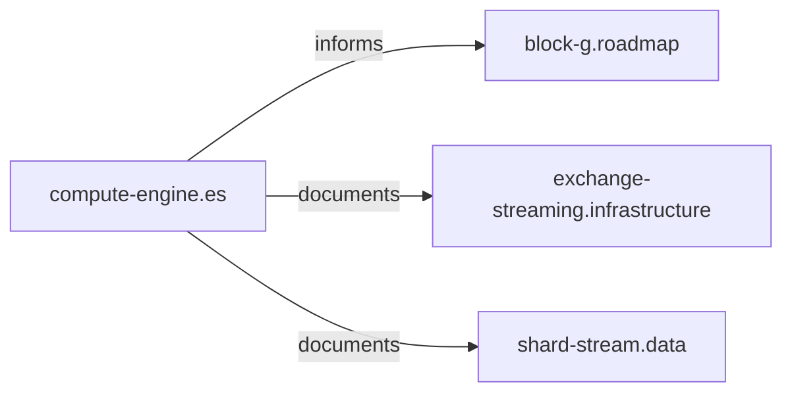

# Compute-engine tag and ES compute hub zettels

## Context

- The design space already has `**compute**` ([docs/design-space/index.md](x-pack/plugin/piescript/docs/design-space/index.md)) for *piescript* computation / distribution, and `**columnar`** / `**es-internals`** for related ideas—but **no dedicated `compute-engine` tag** for Elasticsearch’s `**org.elasticsearch.compute`** stack.
- Piescript already depends on that stack; key imports are in [EvalShard.java](x-pack/plugin/piescript/src/main/java/org/elasticsearch/xpack/piescript/eval/EvalShard.java), [EvalPage.java](x-pack/plugin/piescript/src/main/java/org/elasticsearch/xpack/piescript/eval/EvalPage.java), [EvalExchange.java](x-pack/plugin/piescript/src/main/java/org/elasticsearch/xpack/piescript/eval/EvalExchange.java). Upstream sources live under the ES repo at `**x-pack/plugin/esql/compute/src/main/java/org/elasticsearch/compute/`** (e.g. [Page.java](x-pack/plugin/esql/compute/src/main/java/org/elasticsearch/compute/data/Page.java), [ExchangeService.java](x-pack/plugin/esql/compute/src/main/java/org/elasticsearch/compute/operator/exchange/ExchangeService.java), [Driver.java](x-pack/plugin/esql/compute/src/main/java/org/elasticsearch/compute/operator/Driver.java)).

## 1. Tag taxonomy updates ([docs/design-space/index.md](x-pack/plugin/piescript/docs/design-space/index.md))

- **Add** a row to the **Tags** table:
  - `**compute-engine`** — Elasticsearch’s columnar runtime: `org.elasticsearch.compute` (data `Page`/`Block`/`BlockFactory`, `Driver`/`Operator` chains, exchange); distinct from `**compute`** (piescript execution model).
- **Tighten** the `**columnar`** row (one line) so it **points at `compute-engine*`* for “the engine” vs “columnar representation” to reduce overlap without removing `columnar`.
- **Tag aliases** ([docs/design-space/index.md](x-pack/plugin/piescript/docs/design-space/index.md) § Tag aliases): add `**es-compute` → `compute-engine`** (common shorthand; no existing alias covers this).
- **Tag groups**: add `**compute-engine`** to the **Data path** topic group (same table row as `lucene`, `columnar`, `materialization`, …) so it appears in the “how data flows” cluster.

**Note:** [docs/design-space/catalog.py](x-pack/plugin/piescript/docs/design-space/catalog.py) does not expand aliases; that stays a **human/catalog convention** documented in the index (same as other aliases).

## 2. Hub zettel: `compute-engine.es.md`

Create **[docs/design-space/zettels/compute-engine.es.md](x-pack/plugin/piescript/docs/design-space/zettels/compute-engine.es.md)**:

- **Purpose:** Short, stable overview of the ES compute engine: columnar batches (`Page`/`Block`), `**Driver`** as the single-threaded executor of an `Operator` chain that passes `Page`s, and how **exchange** moves pages between tasks/nodes; relation to ESQL’s pipeline (high level, no full operator catalog).
- **Frontmatter:** `tags` including `es-internals`, `compute-engine`, `documentation`, `concept` (and `implemented` if you treat the engine as shipped ES infrastructure). `**refs`:** `adr:D-054`; `**plan:compute_engine_streaming_f5db78f2`** (Block G implementation — streaming/Page/Exchange in piescript); `**plan:compute_engine_zettels_8b517c82**` (this plan — design-space tag, hub, and ES `code:` zettels); plus `**code:**` pointers to 1–2 anchor types, e.g. `Page.java` and optionally `Driver.java` as the execution-model anchor.
- **Child zettels subsumed from hub:** link to [[compute-data-page-block.es]], [[compute-exchange-service.es]], [[compute-driver.es]] (via **Connections** / **subsumes**).
- **Graph:** **Depends on:** (none) or minimal. **Enables:** understanding of child zettels. **Connections:** `part-of` / `documents` / `implements` edges to:
  - [[block-g.roadmap]]
  - [[exchange-streaming.infrastructure]]
  - [[shard-stream.data]]
  - [[type-stack.data]]
  - Optional: [[blockloader.data]] (future optimization / same repo)

## 3. Child zettels (ES Java classes “worthy” of first-class notes)

Add **three** focused zettels with `code:` refs to **repo-relative paths under `x-pack/plugin/esql/compute/...`** (not only FQCNs in prose). Naming follows `topic.qualifier.md` with `.es` for Elasticsearch-internal topics.

| Zettel file                      | Focus                                                                                                                                                                                                                                                         | Primary `code:` targets                                                                                                                                                                 |
| -------------------------------- | ------------------------------------------------------------------------------------------------------------------------------------------------------------------------------------------------------------------------------------------------------------- | --------------------------------------------------------------------------------------------------------------------------------------------------------------------------------------- |
| `compute-data-page-block.es.md`  | `Page`, `Block`, `BlockFactory`, typed `*Block` builders                                                                                                                                                                                                      | `.../compute/data/Page.java`, `Block.java`, `BlockFactory.java`                                                                                                                         |
| `compute-exchange-service.es.md` | `ExchangeService`, `ExchangeSink`, `ExchangeSource`, handlers                                                                                                                                                                                                 | `.../operator/exchange/ExchangeService.java`, related types used by [EvalExchange.java](x-pack/plugin/piescript/src/main/java/org/elasticsearch/xpack/piescript/eval/EvalExchange.java) |
| `compute-driver.es.md`           | `**Driver**` — single-threaded execution of a chain of `**Operator`s**, passing `**Page`s** from source to sink; lifecycle and status (see Javadoc in [Driver.java](x-pack/plugin/esql/compute/src/main/java/org/elasticsearch/compute/operator/Driver.java)) | `.../operator/Driver.java`; optionally `Operator.java` for chain semantics                                                                                                              |

**Note:** Piescript’s [EvalShard](x-pack/plugin/piescript/src/main/java/org/elasticsearch/xpack/piescript/eval/EvalShard.java) builds `Page`s via `Block` builders but does not instantiate `**Driver`**. The Driver zettel is still part of the hub for ESQL pipeline / engine literacy and links `**org.elasticsearch.compute`** package documentation referenced from `Driver`.

Each child zettel: `tags` include `es-internals`, `compute-engine`, `columnar`, `infrastructure` (or `documentation`); `refs` include `adr:D-054` where relevant; **Connections:** `part-of: [[compute-engine.es]]`, and `used-by:` / `informs:` edges to [[shard-stream.data]], [[exchange-streaming.infrastructure]], or [[evaluator.language]] as appropriate.

## 4. Back-links from existing zettels

Update (minimal edits) these piescript-centric zettels so the graph is navigable **from Block G toward ES internals**:

- [exchange-streaming.infrastructure.md](x-pack/plugin/piescript/docs/design-space/zettels/exchange-streaming.infrastructure.md) — add **Connection** `uses` / `documents` → [[compute-engine.es]], and optionally → [[compute-exchange-service.es]].
- [shard-stream.data.md](x-pack/plugin/piescript/docs/design-space/zettels/shard-stream.data.md) — link to [[compute-engine.es]] and [[compute-data-page-block.es]].
- [block-g.roadmap.md](x-pack/plugin/piescript/docs/design-space/zettels/block-g.roadmap.md) — add **subsumes** or **connections** to [[compute-engine.es]] (hub for upstream ES code).

Optionally add `**compute-engine` to tags on those zettels only if they discuss the engine explicitly (avoid tag spam).

## 5. Optional follow-ups (out of scope unless you want them in the same PR)

- Regenerate or spot-check [docs/design-space/metrics.md](x-pack/plugin/piescript/docs/design-space/metrics.md) if your workflow auto-updates counts from new zettels.
- Extend [docs/design-space/catalog.py](x-pack/plugin/piescript/docs/design-space/catalog.py) with `python3 catalog.py compute-engine` filtering—only if you want alias expansion for CLI filters (not required for the docs change).

## Files to touch

| File                                                                                                                                                                                                                                                                                                                       | Change                                          |
| -------------------------------------------------------------------------------------------------------------------------------------------------------------------------------------------------------------------------------------------------------------------------------------------------------------------------- | ----------------------------------------------- |
| [docs/design-space/index.md](x-pack/plugin/piescript/docs/design-space/index.md)                                                                                                                                                                                                                                           | New tag, alias, group row, `columnar` cross-ref |
| `docs/design-space/zettels/compute-engine.es.md`                                                                                                                                                                                                                                                                           | **New** hub                                     |
| `docs/design-space/zettels/compute-data-page-block.es.md`                                                                                                                                                                                                                                                                  | **New** child                                   |
| `docs/design-space/zettels/compute-exchange-service.es.md`                                                                                                                                                                                                                                                                 | **New** child                                   |
| `docs/design-space/zettels/compute-driver.es.md`                                                                                                                                                                                                                                                                           | **New** child (`Driver` / operator chain)       |
| [exchange-streaming.infrastructure.md](x-pack/plugin/piescript/docs/design-space/zettels/exchange-streaming.infrastructure.md), [shard-stream.data.md](x-pack/plugin/piescript/docs/design-space/zettels/shard-stream.data.md), [block-g.roadmap.md](x-pack/plugin/piescript/docs/design-space/zettels/block-g.roadmap.md) | Small connection/tag updates                    |

