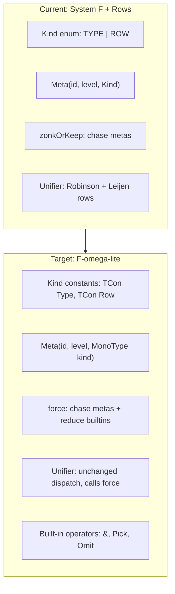

# F-omega-lite Type System and ESQL Grouping Functions

## Motivation

ESQL grouping (STATS ... BY) requires the output row type to be the merge of group keys and aggregate results. This needs row-level type computation (`g & a`), which the current System F + rows system cannot express. Rather than ad-hoc workarounds, we extend the type system toward F-omega-lite with three incremental steps: kinds-as-types, a type-level normalizer, and built-in row operators.

## Architecture Overview




---

## Phase 1: Kinds as Types + Arrow Kinds

**Goal**: Eliminate the `Kind` enum. Kinds become `MonoType` values, and kind constraints become unification constraints solved by the same unifier. Assign proper arrow kinds to all type constructors from the start.

### Kind constants and arrow kinds

Base kinds are `MonoType` constants: `TCon("Type")`, `TCon("Row")`. Arrow kinds use the existing `MonoType.Arrow`:

```
List     : Type -> Type
Channel  : Type -> Type
ESQL     : Row -> Type
Index    : Row -> Type
Searcher : Row -> Type
DocRef   : Row -> Type
Writer   : Row -> Type
Record   : Row -> Type
```

Note: `Type : Type` and `Row : Type` — base kinds are themselves types of kind `Type`. This means `Row` is a valid `TCon` that can appear in type annotations.

A **kind context** (parallel to the typing context's module map) maps type constructor names to their kinds. The elaborator consults it to emit kind constraints when processing type-level applications. For `AppType(List, Integer)`:
1. Look up `kind("List")` → `Type → Type`
2. Look up `kind("Integer")` → `Type`
3. Allocate fresh kind meta `?k0`
4. Emit constraint: `Type → Type ~ Type → ?k0`
5. Solved: `?k0 = Type` → `List Integer : Type`

Kind errors like `List List` fail naturally: `kind("List") = Type → Type` but `kind("List") = Type → Type`, so constraint becomes `Type → Type ~ (Type → Type) → ?k` which fails because `Type ≠ Type → Type`.

### Files to change

- **[Kind.java](x-pack/plugin/piescript/src/main/java/org/elasticsearch/xpack/piescript/types/Kind.java)**: Delete. Replace with `MonoType` constants.
- **[MonoType.java](x-pack/plugin/piescript/src/main/java/org/elasticsearch/xpack/piescript/types/MonoType.java)**:
  - `Meta(int id, int bindingLevel, Kind kind)` -> `Meta(int id, int bindingLevel, MonoType kind)`
  - `Rigid(int id, Kind kind)` -> `Rigid(int id, MonoType kind)`
  - Remove `isRowKinded` static method (kind correctness becomes a unification concern)
  - Remove the assertion from `RecordType` constructor
- **[RowType.java](x-pack/plugin/piescript/src/main/java/org/elasticsearch/xpack/piescript/types/RowType.java)**: Remove the `isRowKinded` assertion in the compact constructor.
- **[TypeScheme.java](x-pack/plugin/piescript/src/main/java/org/elasticsearch/xpack/piescript/types/TypeScheme.java)**: `Map<Integer, Kind>` -> `Map<Integer, MonoType>` (values are now kind-types like `TCon("Type")`, `TCon("Row")`, or `Arrow(TCon("Row"), TCon("Type"))`).
- **[Types.java](x-pack/plugin/piescript/src/main/java/org/elasticsearch/xpack/piescript/types/Types.java)**: Add `TYPE` and `ROW` constants as `TCon("Type")` and `TCon("Row")`. Update `meta(...)` and `rigid(...)` factory methods to take `MonoType` instead of `Kind`.
- **[ElaborationState.java](x-pack/plugin/piescript/src/main/java/org/elasticsearch/xpack/piescript/elab/ElaborationState.java)**: `freshType`/`freshRow` use the new `MonoType` constants. `freshRigid(Kind)` -> `freshRigid(MonoType)`.
- **[Prelude.java](x-pack/plugin/piescript/src/main/java/org/elasticsearch/xpack/piescript/elab/Prelude.java)**: All `Rigid(-N, Kind.TYPE)` -> `Rigid(-N, TYPE_CONST)`, all `Kind.ROW` -> `ROW_CONST`. All `quantified.put(id, Kind.TYPE)` -> `quantified.put(id, TYPE_CONST)`. (~30 call sites across the type scheme methods.) Add a `KINDS` map (`Map<String, MonoType>`) mapping each type constructor name to its kind.
- **[ElaborationContext.java](x-pack/plugin/piescript/src/main/java/org/elasticsearch/xpack/piescript/elab/ElaborationContext.java)**: Add a `kindModule` field (`Map<String, MonoType>`) parallel to `module`. Update `withModule` to accept both maps. Add `lookupKind(String name)` method.
- **[Elaborator.java](x-pack/plugin/piescript/src/main/java/org/elasticsearch/xpack/piescript/elab/Elaborator.java)**: Pass `Prelude.KINDS` to `ElaborationContext.withModule`.
- **[TypeAnnotations.java](x-pack/plugin/piescript/src/main/java/org/elasticsearch/xpack/piescript/elab/TypeAnnotations.java)**: In `translateApp`, when processing `TypeApplicationContext` (i.e., `AppType`), emit kind constraints: look up kind of constructor and argument from the kind context, allocate a fresh kind meta, and emit `kind(ctor) ~ kind(arg) → ?k`.
- **[Polymorphism.java](x-pack/plugin/piescript/src/main/java/org/elasticsearch/xpack/piescript/elab/Polymorphism.java)**: `generalize` collects `Map<Integer, MonoType>` (kinds) instead of `Map<Integer, Kind>`. `instantiateAndWrap` dispatches on `MonoType` kind equality instead of `Kind` enum comparison (e.g., check if kind equals `ROW_CONST` to decide `freshRow` vs `freshType`).
- **[TypeWalker.java](x-pack/plugin/piescript/src/main/java/org/elasticsearch/xpack/piescript/elab/TypeWalker.java)**: `collectMetas` accumulates `Map<Integer, MonoType>` instead of `Map<Integer, Kind>`.
- **[TypeAnnotations.java](x-pack/plugin/piescript/src/main/java/org/elasticsearch/xpack/piescript/elab/TypeAnnotations.java)**: `freshRigid(Kind.TYPE)` -> `freshRigid(TYPE_CONST)`, `freshRigid(Kind.ROW)` -> `freshRigid(ROW_CONST)`. TypeScheme construction uses `MonoType` map.
- **[Unifier.java](x-pack/plugin/piescript/src/main/java/org/elasticsearch/xpack/piescript/elab/Unifier.java)**: The `asRowType` helper needs adjustment since we no longer check `m.kind() == Kind.ROW` — instead check if `m.kind()` equals `ROW_CONST`.
- **[CoreTypeAbs.java](x-pack/plugin/piescript/src/main/java/org/elasticsearch/xpack/piescript/core/CoreTypeAbs.java)**: `Kind kind` field -> `MonoType kind`.
- **[CorePrinter.java](x-pack/plugin/piescript/src/main/java/org/elasticsearch/xpack/piescript/core/CorePrinter.java)**: `rigidName(int id, Kind kind)` -> dispatch on `MonoType` kind value.
- **[CoreExprSerialization.java](x-pack/plugin/piescript/src/main/java/org/elasticsearch/xpack/piescript/core/CoreExprSerialization.java)**: Serialize kind as `MonoType` (via `writeMonoType`/`readMonoType`) instead of `writeKind`/`readKind`.
- **[TypeSerialization.java](x-pack/plugin/piescript/src/main/java/org/elasticsearch/xpack/piescript/types/TypeSerialization.java)**: `writeKind`/`readKind` become `writeMonoType`/`readMonoType` calls for the kind field on Meta/Rigid. The `Kind`-specific methods can be removed. No transport version guard needed (piescript is pre-release).
- **[Exprs.java](x-pack/plugin/piescript/src/main/java/org/elasticsearch/xpack/piescript/core/Exprs.java)**: Test helper `typeAbs(int, Kind, CoreExpr)` -> `typeAbs(int, MonoType, CoreExpr)`.
- **Tests**: [UnifierTests.java](x-pack/plugin/piescript/src/test/java/org/elasticsearch/xpack/piescript/elab/UnifierTests.java), [ElaborationStateTests.java](x-pack/plugin/piescript/src/test/java/org/elasticsearch/xpack/piescript/elab/ElaborationStateTests.java), [SerializationRoundTripTests.java](x-pack/plugin/piescript/src/test/java/org/elasticsearch/xpack/piescript/serial/SerializationRoundTripTests.java) — update `Kind.TYPE`/`Kind.ROW` references to the new MonoType constants.

### Tests

- All existing tests must pass unchanged (same behavior, different representation).
- Update [UnifierTests.java](x-pack/plugin/piescript/src/test/java/org/elasticsearch/xpack/piescript/elab/UnifierTests.java), [ElaborationStateTests.java](x-pack/plugin/piescript/src/test/java/org/elasticsearch/xpack/piescript/elab/ElaborationStateTests.java), [SerializationRoundTripTests.java](x-pack/plugin/piescript/src/test/java/org/elasticsearch/xpack/piescript/serial/SerializationRoundTripTests.java) to use new `MonoType` kind constants instead of `Kind` enum.
- Add kind-constraint tests: verify that `AppType(List, List)` produces a kind error, `AppType(ESQL, RowType({...}))` succeeds, etc.

---

## Phase 2: Type-Level NbE Normalizer (`force`)

**Goal**: Replace `zonkOrKeep` with `force` — an NbE-style normalizer that chases metas AND reduces built-in type operators. Add `&` (row merge) as the first built-in.

### Design

Types after `force` are in **head-normal form** (WHNF for types):

- **Normal**: `TCon`, `Arrow`, `RecordType`, `RowType` — already values
- **Neutral (stuck)**: `AppType` where the head is an atom (`List`, `ESQL`, ...) or an unsolved `Meta`
- **Reducible**: `AppType` where the head is a known builtin (`&`) and all arguments are concrete -> reduces to a `RowType`

Unification always pattern-matches on forced forms. Stuck `AppType` vs concrete type = `TypeError.Mismatch`. Stuck `AppType` vs stuck `AppType` = structural decomposition (already in the unifier).

### Files to change

- **[ElaborationState.java](x-pack/plugin/piescript/src/main/java/org/elasticsearch/xpack/piescript/elab/ElaborationState.java)**: Add `force(MonoType)` method. This subsumes `zonkOrKeep` — chase metas, then if `AppType`, force constructor and argument, attempt reduction via `reduceApp`. Keep `zonkOrKeep` as a deprecated delegate to `force` during transition, or replace all call sites.
- **[Unifier.java](x-pack/plugin/piescript/src/main/java/org/elasticsearch/xpack/piescript/elab/Unifier.java)**: Replace `zonkOrKeep` calls at the top of `unify` and `asRowType` with `force`. The `asRowType` helper must now handle stuck `AppType` (a row-kinded computation that hasn't reduced) — this can only happen if someone constructs a `RecordType` with a stuck `&`, which is a type error via unification.
- **[TypeWalker.java](x-pack/plugin/piescript/src/main/java/org/elasticsearch/xpack/piescript/elab/TypeWalker.java)**: `resolveDeep` and `collectMetas` should use `force` instead of `zonkOrKeep` so that reduced type-level computations are traversed correctly.
- **[Polymorphism.java](x-pack/plugin/piescript/src/main/java/org/elasticsearch/xpack/piescript/elab/Polymorphism.java)**: `instantiateBody` should use `force` where it currently uses `zonkOrKeep`.
- **[Elaborator.java](x-pack/plugin/piescript/src/main/java/org/elasticsearch/xpack/piescript/elab/Elaborator.java)**: Register `TCon("&")` alongside other type constructors. Add it to `KNOWN_TYPES` so surface type annotations can reference it (if desired).

### `&` Reduction Rule

`&` has kind `Row -> Row -> Row`. Overlap is **right-biased**: when both rows contain the same label, the right operand's type wins (consistent with TypeScript `&` intersection semantics).

```
force(AppType(AppType(TCon("&"), left), right)):
  let l = force(left), r = force(right)
  if l is RowType and r is RowType:
    merge fields (right-biased on overlapping labels), merge tails:
      both closed -> closed merged row
      one open -> open merged row with the open tail
      both open -> open merged row with fresh tail meta
  else:
    stuck: AppType(AppType(TCon("&"), l), r)
```

### Tests

- [ElaborationStateTests.java](x-pack/plugin/piescript/src/test/java/org/elasticsearch/xpack/piescript/elab/ElaborationStateTests.java): unit tests for `force` — concrete merge, stuck on metas, nested merge `(a & b) & c`, merge with open rows, right-biased overlap.
- [UnifierTests.java](x-pack/plugin/piescript/src/test/java/org/elasticsearch/xpack/piescript/elab/UnifierTests.java): unification through `force` — two merged rows unify correctly, stuck `AppType` vs `RowType` produces mismatch, stuck vs stuck decomposes.
- Verify all existing unifier tests still pass (force is backward-compatible with zonkOrKeep).

---

## Phase 3: `Pick` and `Omit` (row projection and subtraction)

**Goal**: Add two more built-in row operators for precise typing of `ESQL.keep` and `ESQL.drop`.

### Design

Both operators take two rows. The second row acts as a "selector" — only its labels matter, and overlapping labels must have matching types (mismatch is a type error).

- `Pick : Row -> Row -> Row` — from the first row, keep only fields whose labels also appear in the second row. Types must match on shared labels. Result contains the shared fields.
- `Omit : Row -> Row -> Row` — from the first row, remove fields whose labels appear in the second row. Types must match on shared labels. Result contains the fields from the first row that are NOT in the second.

Both have kind `Row -> Row -> Row` and reduce in `force` when both operands are concrete `RowType`s.

### `Pick` Reduction Rule

```
force(AppType(AppType(TCon("Pick"), left), right)):
  let l = force(left), r = force(right)
  if l is RowType and r is RowType:
    for each label in intersection(l.fields, r.fields):
      emit unification constraint: l.fields[label] ~ r.fields[label]
    result = RowType(only fields from l whose labels are in r)
  else:
    stuck
```

### `Omit` Reduction Rule

```
force(AppType(AppType(TCon("Omit"), left), right)):
  let l = force(left), r = force(right)
  if l is RowType and r is RowType:
    for each label in intersection(l.fields, r.fields):
      emit unification constraint: l.fields[label] ~ r.fields[label]
    result = RowType(only fields from l whose labels are NOT in r)
  else:
    stuck
```

### Improved ESQL.keep and ESQL.drop types

The current types `∀(r:Row)(s:Row). List Keyword -> ESQL r -> ESQL s` are replaced with closure-based variants:

```
ESQL.keep : ∀(r:Row)(s:Row). (Record r -> Record s) -> ESQL r -> ESQL (Pick r s)
ESQL.drop : ∀(r:Row)(s:Row). (Record r -> Record s) -> ESQL r -> ESQL (Omit r s)
```

The user writes a projection closure to select fields. The existing accessor syntax (`.foo`) already works as a concise field selector:

```
|> ESQL.keep (\r -> { foo: r.foo, bar: r.bar })
|> ESQL.keep .foo                                  -- single field via accessor
|> ESQL.drop (\r -> { temp: r.temp })
```

`Pick r s` ensures the output row precisely reflects which fields from `r` survived. `Omit r s` ensures the output row precisely reflects which fields from `r` remain after removal. Both are strictly more precise than the current unconstrained `ESQL s`.

### Files to change

- **[ElaborationState.java](x-pack/plugin/piescript/src/main/java/org/elasticsearch/xpack/piescript/elab/ElaborationState.java)**: Add `Pick` and `Omit` reduction cases in `force` / `reduceApp`, alongside `&`.
- **[Prelude.java](x-pack/plugin/piescript/src/main/java/org/elasticsearch/xpack/piescript/elab/Prelude.java)**: Update `ESQL.keep` and `ESQL.drop` type schemes to use closure-based variants with `Pick`/`Omit`.
- **[EvalBuiltins.java](x-pack/plugin/piescript/src/main/java/org/elasticsearch/xpack/piescript/eval/EvalBuiltins.java)**: Update `ESQL.keep`/`ESQL.drop` NbE compilation to use the closure (partially evaluate with `Symbol("")`, extract field names from the resulting record).
- **Tests**:
  - [ElaborationStateTests.java](x-pack/plugin/piescript/src/test/java/org/elasticsearch/xpack/piescript/elab/ElaborationStateTests.java): `Pick` and `Omit` reduction with concrete rows, type-mismatch error on overlapping labels with different types, stuck terms.
  - [EvaluatorTests.java](x-pack/plugin/piescript/src/test/java/org/elasticsearch/xpack/piescript/eval/EvaluatorTests.java): `ESQL.keep` / `ESQL.drop` with closure-based API compile to correct ESQL strings (test via `ESQL.explain`).
  - [test-multinode.sh](x-pack/plugin/piescript/debug/test-multinode.sh): add `ESQL.keep`/`ESQL.drop` with closure syntax tests alongside existing tests 15-18.

---

## Phase 4: `ESQL.stats`, `ESQL.statsBy`, and Aggregate Builtins

**Goal**: Implement the actual ESQL grouping feature using the type-level `&` from Phase 2.

### Type Design

No `Agg` wrapper type or `StripAgg` operator. Aggregate builtins type with their **plain output types**. The distinction between aggregate and scalar expressions is enforced at the value level (NbE compilation) and validated by ESQL at runtime, not by the type system.

Aggregate builtins (plain output types):

```
ESQL.count   : Keyword -> Double
ESQL.countOf : ∀(r:Row)(a:Type). (Record r -> a) -> Double
ESQL.avg     : ∀(r:Row). (Record r -> Double) -> Double
ESQL.sum     : ∀(r:Row). (Record r -> Double) -> Double
ESQL.max     : ∀(r:Row)(a:Type). (Record r -> a) -> a
ESQL.min     : ∀(r:Row)(a:Type). (Record r -> a) -> a
```

Stats combinators — two variants to avoid optionality of the BY clause:

```
ESQL.stats   : ∀(r:Row)(s:Row). (Record r -> Record s) -> ESQL r -> ESQL s
ESQL.statsBy : ∀(r:Row)(s:Row)(t:Row). (Record r -> Record s) -> (Record r -> Record t) -> ESQL r -> ESQL (s & t)
```

- `ESQL.stats` takes a single agg closure mapping the input row to aggregate results. No grouping.
- `ESQL.statsBy` takes an agg closure AND a group closure. Output row is `s & t` — the merge of aggregate results and group keys.

Grouping functions (used inside the group closure of `statsBy`):

- `ESQL.bucket : Double -> Double -> Double` — scalar function. NbE compilation produces `BUCKET(field, span)` when called inside a group closure with `Symbol` arguments.

### Example usage

```
-- COUNT and AVG salary, grouped by department
query
  ESQL.from employees
  |> ESQL.statsBy
       (\r -> { count: ESQL.count, avg_salary: ESQL.avg .salary r })
       (\r -> { dept: r.department })
;
-- compiles to: FROM employees | STATS count = COUNT(*), avg_salary = AVG(salary) BY dept = department
```

### Tradeoff

The type system cannot statically distinguish aggregate closures from scalar closures — both type as `Record r -> Record s`. Writing `ESQL.stats (\r -> { x: r.salary + 1 }) pipeline` type-checks but ESQL rejects it at runtime. This is the right tradeoff: the ESQL engine validates aggregate semantics, and eliminating `Agg`/`StripAgg` removes significant type-system complexity. An `Agg` marker type can be added later for better diagnostics without changing the stats type signatures.

### Files to change

- **[Prelude.java](x-pack/plugin/piescript/src/main/java/org/elasticsearch/xpack/piescript/elab/Prelude.java)**: Add type schemes for `ESQL.stats`, `ESQL.statsBy`, `ESQL.count`, `ESQL.countOf`, `ESQL.avg`, `ESQL.sum`, `ESQL.max`, `ESQL.min`, `ESQL.bucket`. Add entries to `ARITY` map.
- **[EvalBuiltins.java](x-pack/plugin/piescript/src/main/java/org/elasticsearch/xpack/piescript/eval/EvalBuiltins.java)**: Add NbE compilation cases:
  - Aggregate builtins (`ESQL.count`, `ESQL.avg`, etc.) produce `Value.Symbol` fragments like `Symbol("COUNT(*)")`, `Symbol("AVG(salary)")` when partially evaluated with symbolic row arguments.
  - `ESQL.stats` — partially evaluate the agg closure with `Symbol("")`, walk the result record, compile each field to `name = fragment`, emit `| STATS name1 = AGG1, name2 = AGG2`.
  - `ESQL.statsBy` — partially evaluate both closures, compile agg fields and group fields, emit `| STATS agg1 = AGG1, ... BY key1 = expr1, ...`.
  - `ESQL.bucket` — produces `Symbol("BUCKET(field, span)")` when applied to `Symbol` arguments.
- **Tests**:
  - [EvaluatorTests.java](x-pack/plugin/piescript/src/test/java/org/elasticsearch/xpack/piescript/eval/EvaluatorTests.java): NbE compilation tests using `ESQL.explain` — verify `ESQL.stats` compiles to `| STATS ...`, `ESQL.statsBy` compiles to `| STATS ... BY ...`, aggregate builtins compile to `COUNT(*)`, `AVG(field)`, etc., `ESQL.bucket` compiles to `BUCKET(field, span)`.
  - [ElaboratorTests.java](x-pack/plugin/piescript/src/test/java/org/elasticsearch/xpack/piescript/elab/ElaboratorTests.java): elaborate programs using `ESQL.stats`/`ESQL.statsBy` — verify output types are correct (merged row for `statsBy`).
  - [test-multinode.sh](x-pack/plugin/piescript/debug/test-multinode.sh): add end-to-end stats tests against the `piescript-test` index:
    - `ESQL.stats` with `ESQL.count` (global count)
    - `ESQL.statsBy` with `ESQL.count` + `ESQL.avg` grouped by `active`
    - `ESQL.explain` for each to verify compiled ESQL strings
  - [test-eval.sh](x-pack/plugin/piescript/debug/test-eval.sh): add basic stats smoke tests for single-node.

---

## Phase 5: Tests, Documentation, and Debug Scripts

**Goal**: Comprehensive test coverage, updated documentation, and manual testing scripts for all new features.

### Unit tests

Each phase should have its own test additions, but a dedicated pass ensures nothing is missed:

- **[UnifierTests.java](x-pack/plugin/piescript/src/test/java/org/elasticsearch/xpack/piescript/elab/UnifierTests.java)**: Tests for `force`-based unification: unifying two `&`-merged rows, stuck `AppType` vs concrete row (expect mismatch), stuck vs stuck (decomposition), `Pick`/`Omit` reduction through unification, kind constraint emission and failure for malformed `AppType` (e.g., `List List`).
- **[ElaborationStateTests.java](x-pack/plugin/piescript/src/test/java/org/elasticsearch/xpack/piescript/elab/ElaborationStateTests.java)**: Tests for `force` method directly: concrete `&` merge, `Pick`, `Omit` reductions, stuck terms with unsolved metas, nested reductions (`(a & b) & c`), open-row merge.
- **[ElaboratorTests.java](x-pack/plugin/piescript/src/test/java/org/elasticsearch/xpack/piescript/elab/ElaboratorTests.java)**: End-to-end elaboration tests: programs using `ESQL.stats`/`ESQL.statsBy` elaborate with correct output types, `ESQL.keep`/`ESQL.drop` with closure-based API produce correct `Pick`/`Omit` types, kind errors from misapplied type constructors are reported.
- **[EvaluatorTests.java](x-pack/plugin/piescript/src/test/java/org/elasticsearch/xpack/piescript/eval/EvaluatorTests.java)**: NbE compilation tests (no real ESQL execution, use `ESQL.explain` to verify compiled strings):
  - `ESQL.stats` produces `| STATS name = AGG(...)` fragments
  - `ESQL.statsBy` produces `| STATS ... BY ...` fragments
  - `ESQL.count`, `ESQL.avg`, etc. compile correctly as aggregate expressions
  - `ESQL.bucket` compiles to `BUCKET(field, span)` inside a group closure
  - `ESQL.keep`/`ESQL.drop` with closures compile to `| KEEP field1, field2` / `| DROP field1`
- **[TypeDataStructureTests.java](x-pack/plugin/piescript/src/test/java/org/elasticsearch/xpack/piescript/types/TypeDataStructureTests.java)**: Tests for `MonoType` with `MonoType`-kinded metas and rigids, verifying equality/hashing still works.
- **[SerializationRoundTripTests.java](x-pack/plugin/piescript/src/test/java/org/elasticsearch/xpack/piescript/serial/SerializationRoundTripTests.java)**: Round-trip serialization of `Meta`/`Rigid` with `MonoType` kinds, `AppType` chains representing `&`/`Pick`/`Omit`.

### Debug scripts

- **[test-multinode.sh](x-pack/plugin/piescript/debug/test-multinode.sh)**: Add new test cases after the existing ESQL tests (tests 15-18):
  - `ESQL.stats` — `STATS COUNT(*)` on the `piescript-test` index
  - `ESQL.statsBy` — `STATS COUNT(*), AVG(age) BY active`
  - `ESQL.statsBy` with `ESQL.bucket` — bucketed aggregation
  - `ESQL.keep` with closure syntax — verify compiled ESQL
  - `ESQL.drop` with closure syntax
  - `ESQL.explain` for each new combinator to verify compiled ESQL strings
- **[test-eval.sh](x-pack/plugin/piescript/debug/test-eval.sh)**: Add basic stats smoke tests (simpler programs, single-node).
- **[setup-test-index-multinode.sh](x-pack/plugin/piescript/debug/setup-test-index-multinode.sh)**: Verify the `piescript-test` index has suitable data for aggregation tests (it already has `name`, `age`, `score`, `active` fields — should be sufficient).

### Documentation

- **[decisions.md](x-pack/plugin/piescript/docs/decisions.md)**: New decision entry (D-05X) covering:
  - F-omega-lite type system extension: motivation, kinds-as-types, `force` NbE normalizer
  - Built-in row operators `&`, `Pick`, `Omit`: semantics, reduction rules, overlap policies
  - `ESQL.stats`/`ESQL.statsBy` type design: two-combinator approach, plain output types, no `Agg`/`StripAgg`
  - Closure-based `ESQL.keep`/`ESQL.drop` replacing `List Keyword` API
  - Rationale for each resolved decision (from the Resolved Decisions section of this plan)
  - Consequences and future directions (type-level lambdas, type families, `Agg` marker type)
- **[current-state.md](x-pack/plugin/piescript/docs/current-state.md)**: Update to reflect:
  - Kind system is now kinds-as-types with arrow kinds
  - `force` replaces `zonkOrKeep` as the type normalizer
  - `&`, `Pick`, `Omit` are available as type-level operators
  - `ESQL.stats`/`ESQL.statsBy` are implemented
  - `ESQL.keep`/`ESQL.drop` now use closure-based API
  - Move `groupBy` / `ESQL.stats` from "not implemented" to "implemented"
- **[roadmap.md](x-pack/plugin/piescript/docs/roadmap.md)**: Update Block F status — `ESQL.stats`/`ESQL.statsBy` implemented. Add note about type-level computation (F-omega-lite) as a cross-cutting capability. Update "Known gaps" to remove stats from deferred list.
- **[project-structure.md](x-pack/plugin/piescript/docs/project-structure.md)**: Update if any new files are added (e.g., if `force` logic is extracted to its own class). Note the deletion of `Kind.java`.
- **[architecture.md](x-pack/plugin/piescript/docs/architecture.md)**: Add a section on type-level computation: the `force` normalizer, atoms vs reducible builtins, the NbE-at-types analogy, and how it extends the existing HM + rows system toward F-omega.

---

## Resolved Decisions

1. **No `Agg` type or `StripAgg`**: Aggregate builtins type with plain output types (`Double`, `a`, etc.). The distinction between aggregates and scalars is value-level only. ESQL validates aggregate semantics at runtime. An `Agg` marker can be added later for diagnostics without changing stats signatures.
2. `**Pick`/`Omit` via row selectors**: Both operators take two rows. The second row's labels act as the selector; overlapping labels must have matching types (mismatch = type error). No type-level label sets or special syntax needed. `ESQL.keep`/`ESQL.drop` become closure-based, and the existing `.foo` accessor syntax provides concise field selection.
3. `**&` is right-biased on overlap**: When both rows contain the same label, the right operand's type wins. Consistent with TypeScript convention. A future typeclass can refine left/right semantics.
4. **Arrow kinds from day one**: Phase 1 assigns proper arrow kinds to all type constructors (`List : Type -> Type`, `ESQL : Row -> Type`, `& : Row -> Row -> Row`, etc.). Kind errors are caught early via unification.
5. **No serialization versioning**: Piescript is pre-release. The `Kind` -> `MonoType` wire format change does not need a transport version guard.

## Future Work: ESQL Expression Wrapper Type

Aggregate builtins currently type with plain output types (`Double`, `a`, etc.). This means using them outside the `ESQL.stats`/`ESQL.statsBy` context is not a type error — the evaluator produces `Symbol` values where the type system promises `Double`, and the lie propagates silently until something forces the value (serialization, concrete arithmetic, etc.).

A future improvement: wrap aggregate results in an ESQL "monad" type (e.g., `Expr a` or reuse `ESQL` at the value level) so that using an aggregate outside the appropriate context fails at type-checking time. The `query ... ;` boundary and a `toString`/`explain`-style function would be the only ways to extract the compiled ESQL string from the wrapper. This would make the aggregate/scalar distinction a type-level concern rather than a runtime one, without needing the full `Agg`/`StripAgg` machinery.

## Future Work: Kind Constraint Improvements

The current kind constraint emission covers the structurally essential case (type application rule in surface annotations). The following improvements would produce crisper "kind error" messages instead of downstream "type mismatch" errors:

1. **Final kind of type annotations**: Emit `kind(T) ~ Type` at ascription sites (`e : T`), let-binding annotations, and lambda parameter annotations. Currently, writing `x : List` (unapplied, kind `Type → Type`) is caught by unification when `List` is used as a value type, but the error says "type mismatch" rather than "kind error: List is not fully applied."
2. **Record field type kinds**: Emit `kind(T) ~ Type` for each field type in `{ foo: T }`. Writing `{ foo: List }` would be caught as a kind error.
3. **Arrow param/result kinds**: Emit `kind(A) ~ Type` and `kind(B) ~ Type` for `A → B` in surface syntax.

All of these are error message improvements, not correctness issues — the unifier catches the underlying problems regardless.

## Open Questions

(none remaining)