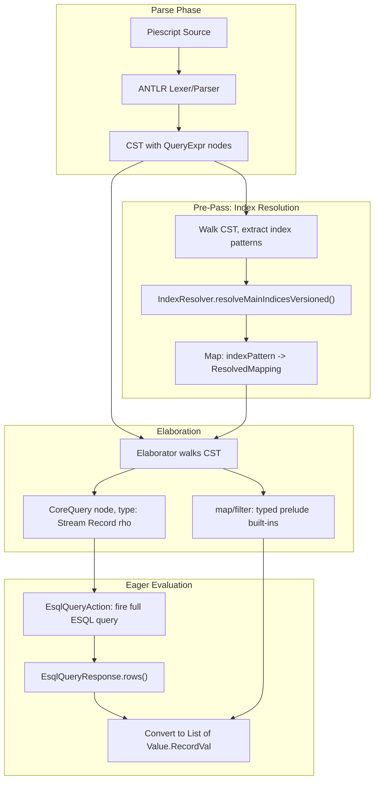

# Phase 2: Index Resolution, Query Typing, and Eager Evaluation

## Inconsistencies Identified

The following inconsistencies between the old plan ([phase2_row_types.plan.md](x-pack/plugin/piescript/.cursor/plans/phase2_row_types.plan.md)) and the current codebase/docs must be resolved:

1. **Old plan says "Blocked on Phase 1d"** -- Phase 1d is complete. Tasks T2.1 (Q2.1/Q2.3), T2.2 (row unification) are already implemented in `Unifier.java` with Leijen-style open-row unification.
2. **Old plan references `IndexResolver.resolveAsMergedMapping()`** -- this method does not exist. The actual API is `IndexResolver.resolveMainIndicesVersioned()` with an async `ActionListener<Versioned<IndexResolution>>` callback. See [IndexResolver.java](x-pack/plugin/esql/src/main/java/org/elasticsearch/xpack/esql/session/IndexResolver.java) lines 143-169.
3. **Old plan's Q2.2 discusses "union-find augmentation"** -- the current implementation uses a plain zonker (`HashMap<Integer, Object>` in [ElaborationState.java](x-pack/plugin/piescript/src/main/java/org/elasticsearch/xpack/piescript/elab/ElaborationState.java)), not a union-find. Concrete-row metadata must be stored alongside the zonker, indexed by meta IDs.
4. **D-016 says `query` should be a `CoreProcess` node, but Phase 3 plan says `CoreProcess` is introduced in Phase 3.** Resolution: Phase 2 introduces `CoreQuery` as a new `CoreExpr` variant. It migrates to `CoreProcess` when Phase 3 introduces the two-layer IR split. This is a pragmatic deviation from D-013, documented as intentional.
5. `**Stream` type does not exist in the current type system. The master plan (Section 3.1) says `Stream : Type -> Type` is a primitive type constructor. Phase 2 must add it.
6. **Old plan omits eager evaluation** -- our discussion established that Phase 2 ends with eager query execution on the coordinator, not just type checking. The evaluator fires `EsqlQueryAction`, iterates `EsqlQueryResponse.rows()`, and converts to piescript `Value.RecordVal`s.
7. **Old plan's vertical slice uses `_yourlang/eval`** -- should be `_piescript/eval`.
8. **Master plan says ESQL body is "passed verbatim"** (Section 2.8) -- we parse only the `FROM` clause to extract index patterns; the rest is opaque. This avoids coupling piescript's parser to ESQL's syntax evolution.
9. `**map`/`filter` in Phase 2 -- current-state.md lists them as Phase 2 work. They get type signatures in the prelude and simple eager per-record evaluation (no plan graph). Phase 3 upgrades them to plan-graph-constructing built-ins.

## Approach Summary




**Delegate to ESQL, do not duplicate.** Piescript sends the full ESQL query string through `EsqlQueryAction` for execution and uses `IndexResolver` for field caps-based type checking. No ESQL parsing, no custom query engine.

## Key Files

- Grammar: [PiescriptLexer.g4](x-pack/plugin/piescript/src/main/antlr/PiescriptLexer.g4), [PiescriptAntlrParser.g4](x-pack/plugin/piescript/src/main/antlr/PiescriptAntlrParser.g4) -- `QUERY` token exists but has no parser rule
- Elaborator: [Elaborator.java](x-pack/plugin/piescript/src/main/java/org/elasticsearch/xpack/piescript/elab/Elaborator.java) -- main dispatch, `KNOWN_TYPES` map
- Type system: [MonoType.java](x-pack/plugin/piescript/src/main/java/org/elasticsearch/xpack/piescript/types/MonoType.java), [RowType.java](x-pack/plugin/piescript/src/main/java/org/elasticsearch/xpack/piescript/types/RowType.java)
- Unifier: [Unifier.java](x-pack/plugin/piescript/src/main/java/org/elasticsearch/xpack/piescript/elab/Unifier.java) -- Leijen-style row unification already implemented
- Transport: [TransportPiescriptAction.java](x-pack/plugin/piescript/src/main/java/org/elasticsearch/xpack/piescript/TransportPiescriptAction.java) -- current passthrough dispatch
- ESQL IndexResolver: [IndexResolver.java](x-pack/plugin/esql/src/main/java/org/elasticsearch/xpack/esql/session/IndexResolver.java)
- ESQL types: [EsField.java](x-pack/plugin/esql/src/main/java/org/elasticsearch/xpack/esql/core/type/EsField.java), [DataType.java](x-pack/plugin/esql/src/main/java/org/elasticsearch/xpack/esql/core/type/DataType.java), [InvalidMappedField.java](x-pack/plugin/esql/src/main/java/org/elasticsearch/xpack/esql/core/type/InvalidMappedField.java)

## Task Breakdown

### T2.1: ANTLR Grammar -- Add `queryExpr` Production

Add a `queryExpr` alternative to the `primary` rule. The `QUERY` token already exists in the lexer. The production captures the ESQL body as raw text between `QUERY` and `SEMICOLON`. Strategy: use a lexer mode or a greedy token rule to capture the opaque ESQL text, with the `FROM` clause parsed structurally to extract index patterns.

Minimal grammar addition:

```antlr
primary
    : ...existing alternatives...
    | QUERY queryBody SEMICOLON    # QueryExpr
    ;

queryBody
    : FROM indexPattern queryTail?
    ;

indexPattern
    : UNQUOTED_SOURCE (COMMA UNQUOTED_SOURCE)*
    ;

queryTail
    : /* opaque ESQL text captured as raw tokens until SEMICOLON */
    ;
```

The exact lexer strategy (mode-based vs greedy rule) is a design detail to resolve during implementation. The key requirement: index patterns are structurally accessible in the CST; the rest of the ESQL body is captured verbatim for reconstruction.

### T2.2: Core IR -- Add `CoreQuery` to `CoreExpr`

Add a new variant to the `CoreExpr` sealed hierarchy:

```java
record CoreQuery(Source source, String esqlQuery, String indexPattern, MonoType type)
    implements CoreExpr { ... }
```

- `esqlQuery`: the full ESQL query string (reconstructed from the CST), ready to pass to `EsqlQueryAction`
- `indexPattern`: the extracted index pattern (for diagnostics and pre-pass keying)
- `type`: `AppType(TCon("Stream"), RecordType(rho))` where `rho` is the row metavar

This is a pragmatic `CoreExpr` variant. It migrates to `CoreProcess` in Phase 3 when the two-layer IR split is introduced. Document this as an intentional deviation from D-013.

### T2.3: Type System -- Add `Stream` Type Constructor and DataType Mapping

- Add `Stream` to `Elaborator.KNOWN_TYPES` or as a dedicated constant: `static final MonoType STREAM = new MonoType.TCon("Stream")`
- Query type is: `new MonoType.AppType(STREAM, new MonoType.RecordType(rho))`
- Create `DataTypeMapping` utility class: maps ESQL `DataType` enum values to piescript `TCon` names

**v0 curated mapping** (cover the types ESQL commonly returns):

- `INTEGER` -> `TCon("Integer")`, `LONG` -> `TCon("Long")`, `DOUBLE` -> `TCon("Double")`
- `KEYWORD` -> `TCon("Keyword")`, `TEXT` -> `TCon("Keyword")` (text fields behave as keywords in query results)
- `BOOLEAN` -> `TCon("Boolean")`, `DATETIME` -> `TCon("DateTime")`, `DATE_NANOS` -> `TCon("DateTime")`
- `IP` -> `TCon("Ip")`, `VERSION` -> `TCon("Version")`, `GEO_POINT` -> `TCon("GeoPoint")`
- `NULL` -> `TCon("Null")`, `UNSIGNED_LONG` -> `TCon("UnsignedLong")`
- `OBJECT` -> nested record type (recurse into `EsField.properties`)
- `UNSUPPORTED` / unmapped -> `TCon("Unsupported")` (access produces a type error)

Add new `TCon` names to `KNOWN_TYPES` as needed. Exotic types (counters, histograms, etc.) map to `TCon("Unsupported")` for v0.

Meta-fields (`_id`, `_index`, `_source`): exclude from the row type for v0. Accessible via ESQL `METADATA` clause if needed.

### T2.4: Index Resolution Pre-Pass

Create an `IndexResolutionPrePass` class that:

1. Walks the CST, collects all `QueryExpr` nodes and their index patterns
2. For each unique index pattern, calls `IndexResolver.resolveMainIndicesVersioned()` (async via `ActionListener`)
3. Builds a `Map<String, ResolvedMapping>` keyed by index pattern

`ResolvedMapping` contains:

- `EsIndex` -- the merged field map (`Map<String, EsField>`)
- `Set<String> partiallyUnmappedFields` -- fields missing in some indices
- Conflict information from `InvalidMappedField` entries (field name -> `Map<String, Set<String>>` types-to-indices)

The pre-pass runs between parsing and elaboration in `TransportPiescriptAction`. Resolution is async; elaboration waits for all resolutions to complete (fan-out via `SubscribableListener` or `CountDownLatch`). Elaboration then proceeds synchronously.

### T2.5: Concrete-Row Constraints

Augment `ElaborationState` with a side-map:

```java
private final Map<Integer, List<ConcreteRow>> concreteRows; // metaId -> concrete rows
```

`ConcreteRow` is:

```java
record ConcreteRow(Map<String, MonoType> fields, Set<String> indices) {}
```

When the elaborator encounters a `QueryExpr`:

1. Translate `ResolvedMapping` fields to a piescript row type via `DataTypeMapping`
2. For `InvalidMappedField` entries, create one `ConcreteRow` per index group (keyed by their type)
3. For consistent fields, include them in all `ConcreteRow`s
4. Attach the `List<ConcreteRow>` to the row metavar's ID in the `concreteRows` map

Augment `Unifier.unifyRows()`: after resolving a row constraint against a meta that has concrete rows, also check the constraint against each `ConcreteRow`. On failure, produce a new `TypeError` variant:

```java
record IndexConflict(String field, MonoType expected, Map<String, Set<String>> typesToIndices)
    implements TypeError {}
```

Concrete rows propagate through the zonker: when two row metas unify, merge their concrete-row lists.

### T2.6: Wire Query Typing into Elaborator

Add a `QueryExpr` case to `Elaborator.elaborate()`:

1. Extract the index pattern from the CST node
2. Look up the `ResolvedMapping` from the pre-pass context (passed into the elaborator or stored on `ElaborationState`)
3. Translate the merged field map to a piescript row type (using `DataTypeMapping`)
4. Create a fresh row metavar `rho`, attach concrete rows
5. Build and return `CoreQuery` with type `AppType(TCon("Stream"), RecordType(rho))`
6. Reconstruct the full ESQL query string from the CST for downstream execution

**Implementation note (tech debt):** The elaborator calls `EsqlBodyParser.parse()` a second time (the first call is in `IndexResolutionPrePass.collectQueries()`) to extract the index pattern from the `ESQL_BODY` token. This double-parse is a direct consequence of the v0 "opaque ESQL_BODY token + Java string extraction" approach. When the ANTLR grammar is improved to structurally capture the `FROM` clause (so the index pattern is a proper CST node), the elaborator will read it directly from the parse tree. See `Queries.java` Javadoc for details.

### T2.7: Built-in `map` and `filter` with Typed Signatures

Register `map` and `filter` in the initial `ElaborationContext` as built-in polymorphic functions:

- `map : forall a b. (a -> b) -> Stream a -> Stream b`
- `filter : forall a. (a -> Boolean) -> Stream a -> Stream a`

These are `TypeScheme`s added to the initial typing context. At use sites, the elaborator instantiates them normally via `Polymorphism.instantiateAndWrap`.

For evaluation (T2.9), these are built-in function values that operate eagerly on lists of records.

### T2.8: Evaluator -- Eager Query Execution

Extend the `Evaluator` to handle `CoreQuery`:

1. Fire `EsqlQueryAction` via the node client (pass the full ESQL query string)
2. Receive `EsqlQueryResponse`
3. Read `response.columns()` for schema (column names + `DataType`s)
4. Iterate `response.rows()` -- each row is `Iterable<Object>` of Java values
5. Convert each row to `Value.RecordVal` using column names as field labels, mapping Java values to piescript `Value` variants (`Integer` -> `IntegerVal`, `String` -> `KeywordVal`, etc.)
6. Return a `Value.ListVal` (new variant) or similar collection value

`map` and `filter` built-in functions operate on this list:

- `map(f, listVal)` -> apply `f` to each record, collect results
- `filter(pred, listVal)` -> apply `pred` to each record, keep truthy ones

This is simple eager evaluation on the coordinator -- no plan graph, no streaming. It serves as a testbed for evaluation semantics. Phase 3 replaces this with `StreamVal` + plan graph.

**Note:** The evaluator needs access to the `Client` for query execution. Thread it through from `TransportPiescriptAction`, or make the evaluator accept a query-execution callback.

### T2.9: Update Transport Pipeline

Refactor `TransportPiescriptAction.doExecute()`:

1. Parse the program (all programs go through the parser now -- remove the `startsWith("query")` string-matching bypass)
2. Run the index resolution pre-pass (async)
3. Elaborate (synchronous, with resolved mappings)
4. Evaluate (with access to the client for query execution)
5. Serialize the response

The old `executeQueryPassthrough` path is subsumed: a bare `query FROM ... ;` is now a program whose only expression is a `QueryExpr`, elaborated and evaluated through the normal pipeline.

### T2.10: Integration Tests

- **Basic query typing:** `query FROM logs-test;` elaborates with correct row type
- **Field access:** `let docs = query FROM logs-test; in docs |> map .message` -- type is `Stream Keyword`
- **Cross-index conflict detected:** `query FROM logs-` where `status` conflicts -- accessing `.status` produces type error with index names
- **Latent conflict OK:** accessing only consistent fields across conflicting indices succeeds
- **Unmapped field:** accessing a field missing in some indices produces an error
- **Polymorphic propagation:** passing query result to a generic function, conflict detected at instantiation
- **Eager evaluation end-to-end:** `let docs = query FROM logs-test; in docs |> map .message` returns actual data
- **Map and filter:** `query FROM logs-test |> filter (fn d -> d.status > 400) |> map .message` returns filtered results

### T2.11: Update Documentation

- Update [roadmap.md](x-pack/plugin/piescript/docs/roadmap.md) task statuses as work completes
- Update [current-state.md](x-pack/plugin/piescript/docs/current-state.md) with new capabilities
- Add decisions to [decisions.md](x-pack/plugin/piescript/docs/decisions.md): DataType mapping policy, `CoreQuery` as `CoreExpr` deviation, eager evaluation approach
- Replace the old [phase2_row_types.plan.md](x-pack/plugin/piescript/.cursor/plans/phase2_row_types.plan.md) with this plan

---

## Phase 2 Completion: Discrepancies from Plan

> Added 2026-03-16 at phase completion. **Ref**: [Phase 2 completion session](303bcf3e-9eef-4719-a47d-24c1ff27a675)

### What was implemented as planned

- **T2.1 (Grammar)**: Implemented as designed, but with backtick delimiters instead of `QUERY ... ;`
syntax. The ESQL body is captured as an opaque `ESQL_BODY` token via an `ESQL_MODE` lexer mode.
- **T2.2 (CoreQuery)**: Implemented as designed. `CoreQuery` is a `CoreExpr` variant (pragmatic
deviation from D-013 as planned).
- **T2.3 (Stream + DataTypeMapping)**: Implemented as designed.
- **T2.4 (Index resolution pre-pass)**: Implemented as designed. Uses `IndexResolver.resolveMainIndicesVersioned()`
with `RefCountingListener` for fan-out. Async boundary managed via `ActionListener` callbacks.
- **T2.6 (Query typing)**: Implemented as designed. Elaborator receives resolved mappings, translates
to row types, returns `CoreQuery` with `Stream { fields... }` type.
- **T2.9 (Transport refactor)**: Implemented as designed. Removed passthrough, unified pipeline.

### Discrepancies and deviations

1. **T2.1: Backtick delimiters instead of semicolons.** The plan specified `query FROM idx;` syntax.
  Implementation uses `query` FROM idx`` (backtick-delimited ESQL body) to avoid ambiguity
   with semicolons in multi-statement ESQL and in piescript's own block syntax.
2. **T2.5: Concrete-row constraints simplified.** The plan described augmenting the zonker with a
  `ConcreteRow` side-map and checking constraints against per-index-group concrete rows with
   detailed `IndexConflict` type errors. The implementation takes a simpler approach: the merged
   mapping from `IndexResolver` is used directly. Cross-index conflicts from `InvalidMappedField`
   are surfaced through the existing `TypeError.MissingFields` mechanism rather than a dedicated
   `IndexConflict` variant. Detailed per-index conflict diagnostics are deferred (tracked in
   roadmap.md as "Empty mapping diagnostics" under Known Limitations).
3. **T2.7: `reduce` added as a third built-in.** The plan specified `map` and `filter`. Implementation
  also added `reduce` (fold) to the prelude, since it was needed for the eager evaluation testbed
   and is a natural companion to `map`/`filter`.
4. **T2.7: Module system for built-ins.** The plan said "register in the initial `ElaborationContext`."
  The implementation introduced a `module` map on `ElaborationContext` and a new `CoreFree` IR node
   for module-level free variables, which is a more principled approach that will extend to a future
   module system. Built-ins go through `Prelude.MODULE` → `ElaborationContext.withModule()` →
   `CoreFree` emission → `BuiltinVal` at runtime.
5. **T2.8: `StreamVal(List<Value>)` instead of `ListVal`.** The plan suggested a `Value.ListVal`.
  Implementation uses `Value.StreamVal(List<Value>)` — semantically clearer and aligned with the
   type system's `Stream` type constructor. Uses `List<Value>` (not `List<RecordVal>`) because `map`
   can transform records into scalars.
6. **T2.8: Thread pool deadlock required `GENERIC` executor.** Not anticipated in the plan.
  `DIRECT_EXECUTOR_SERVICE` caused a deadlock when the evaluator called `actionGet()` on the
   transport thread. Additionally, the `IndexResolutionPrePass` callback ran on `search_coordination`
   threads, causing the same deadlock. Fix: `TransportPiescriptAction` uses `ThreadPool.Names.GENERIC`,
   and resolve callbacks fork to GENERIC before evaluation. See D-004 (revised) and D-039.
7. **T2.10: Fewer negative tests than planned.** The plan specified cross-index conflict detection,
  unmapped field access, latent conflict success, and polymorphic propagation tests. The
   implementation has 15 integration tests covering query type-checking, eager eval end-to-end,
   map/filter/reduce, and expression evaluation — but does not yet have dedicated conflict/unmapped
   integration tests (the conflict detection machinery exists but lacks test index fixtures with
   actual conflicts). This is tracked for future work.
8. **Old `phase2_row_types.plan.md` preserved, not replaced.** The plan said to replace it. Instead
  it was marked as superseded and kept for historical reference.

