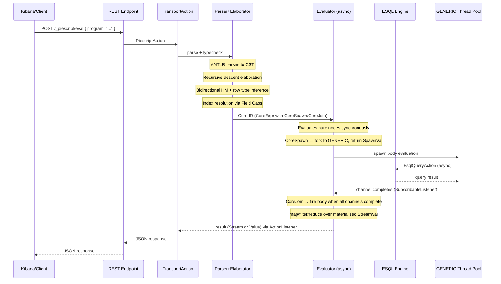
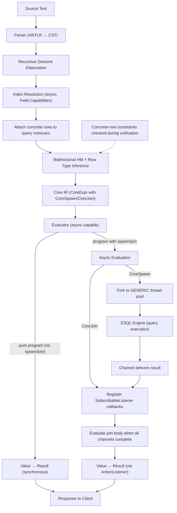

# Scripting Language for Elasticsearch: Design Document

## 1. Vision and Goals

A typed, pure, functional language for **distributed computation** in Elasticsearch, using
π-calculus process primitives to orchestrate data pipelines that run where the data lives. Fills
the gap between ESQL (good at querying, limited at composition/abstraction) and application code
(powerful but external).

**Target users:** Security analysts, observability engineers, data engineers who today stitch
together multiple ESQL queries, Painless scripts, and application glue code.

**Core value proposition:** Composable, type-safe data processing pipelines that combine queries,
transforms, and orchestration in a single language. User-defined functions travel to the nodes
holding the data, rather than pulling data to a single coordinator. The language is pure and
referentially transparent — the only effects are Join Calculus coordination primitives (`spawn`,
`join`, channels), which the async evaluator interprets via Elasticsearch's `ActionListener`
infrastructure. See D-040 and [vision.md](../x-pack/plugin/piescript/docs/vision.md).

See [vision.md](../x-pack/plugin/piescript/docs/vision.md) for the full vision document.

## 2. Decided: Language Core

### 2.1 Evaluation Strategy

- **Strict evaluation** at the expression level
- **Lazy (pull-based) pipelines** at the stream level (inherited from the compute engine's demand-driven operator model)
- No thunks, no STG machine, no space leak concerns

### 2.2 Purity and Effects

- **Pure system with referential transparency**
- No mutable state, no side effects in the expression language
- The only "effect" is process communication (query execution, channel operations), modeled explicitly via Pi-calculus process primitives
- Side-effect story (writes, alerts, etc.) deferred to future versions
- No monads needed for effects: processes and channels model communication explicitly, which is more natural for dataflow programming

### 2.3 Binding and Scope

- **Top-level let bindings** with type annotations using `:` (not `::`):

```
  let f: Int -> Int = fn x -> x + 1;


```

- **Local let bindings** with `let ... in ...`:

```
  let x = 42 in x + 1


```

- Statements terminated by `;`
- Immutable, no rebinding, no mutation
- Shadowing: allowed (OCaml-style) or disallowed (TBD, minor syntax decision)
- Environment is a persistent map from names to values; no mutable slots
- `where` clauses: future work

### 2.4 Functions

- `**fn` keyword for lambdas (not `\` — friendlier for the domain): `fn x -> x + 1`
- **Multi-param sugar**: `fn x y -> ...` desugars to `fn x -> fn y -> ...` (currying)
- **Parameter type annotations**: `fn (x: Int) -> x`
- **Return type + block expression**: `fn (x: Int) -> Int { x }` — block body with the last expression as the implicit return
- **Block expressions**: `{ expr1; expr2; result_expr }` — sequence of expressions, last one is the result. Optional `return` keyword for early/explicit return: `{ return x }`
- First-class functions, higher-order functions
- No general recursion in v0 (no `fix`/`rec` — all iteration is via stream combinators). Revisit if needed.

### 2.5 Records

- Record literals use `:` for field-value pairs: `{ name: "alice", age: 30 }`
- Field projection: `e.field`
- **Record update (injection)** uses `=` to distinguish from literal: `{ o | name = "bob", age = 31 }` — produce a new record identical to `o` but with specified fields replaced. Core expression form, not sugar.
- **Accessor sugar**: `.foo` desugars to `fn x -> x.foo`
- **Update sugar**: `{ _ | foo = 1 }` desugars to `fn x -> { x | foo = 1 }`
- Records are the primary compound data type (no ADTs/sums in v0)
- ES documents are modeled as records with row types derived from index mappings

### 2.6 Pipes

- `e1 |> e2` desugars to `e2 e1` (flip application)
- Primary surface-level composition mechanism
- Natural fit for stream processing chains
- Note: `|` was considered for consistency with ESQL but rejected to avoid ambiguity

### 2.7 Primops and Operators

- Arithmetic: `+`, `-`, `*`, `/`, `%`
- Comparison: `==`, `!=`, `<`, `>`, `<=`, `>=`
- String operations, date operations, etc. — exposed as named functions, not special syntax
- **Primops are infix by default** — standard parsing precedence levels
- Overloaded via ad-hoc compiler resolution in v0; typeclasses in v1
- **User-defined infix operators** (Haskell-style backtick syntax): noted as future work, not v0

### 2.8 Query Syntax

- `query` keyword introduces an ESQL query, terminated by `;`:

```
  let results = query FROM logs-* | WHERE status >= 500;


```

- Everything between `query` and `;` is passed verbatim to ESQL's `PlanExecutor`
- Type of the expression is inferred from index mappings at elaboration time

### 2.9 Pattern Matching (v1)

- **Not in v0**, but planned:

```
  match expr
  | pattern1 -> result1
  | pattern2 -> result2
  | _ -> default


```

- **Shorthand with `_`** wraps in a function: `match _ | 1 -> 0 | 2 -> 1 | _ -> -1` desugars to `fn x -> match x | ...`
- Required once sum types / ADTs are added; useful even with just records and literals
- Pattern matching on record fields, literals, and wildcards

### 2.10 No User-Defined Corecursion

- No `let ones = 1 : ones` or similar coinductive definitions
- Streams come from queries or stream combinators, never from user-defined corecursion
- KISS: avoids need for thunks, cofix, or guardedness checking

### 2.11 No ADTs / Sum Types (v0)

- Records only (JavaScript/JSON model)
- Tagged variants encodable as records: `{ tag: "error", message: "..." }`
- Sum types deferred to future versions
- Typeclasses still possible over primitives and record types

### 2.12 No Recursive Types (No Mu-Types)

- No user-defined recursive type definitions
- Not needed: streams are built-in, ES documents are flat records, no tree-structured data in the domain
- If sum types are added in the future and recursive types become necessary, revisit then

## 3. Decided: Type System

### 3.1 Kind System

Two kinds:

- `Type` — the kind of value types (`Int`, `Keyword`, `Stream Int`, `{ name: Keyword }`, etc.)
- `Row` — the kind of row types (field sequences, row variables). Not parameterized: just `Row`, not `Row k`.

Kind assignments for built-in constructors:

- `Stream : Type -> Type`
- `Process : Type -> Type`
- `(->) : Type -> Type -> Type`
- `{ ... | r } : Type` (row types have kind `Type` when closed/used as record types; `r` has kind `Row`)

### 3.2 Base Types and Type Representation

- All ES base types represented uniformly as `TCon <string>`: `Keyword` is `TCon "Keyword"`, `Int` is `TCon "Int"`, `DateTime` is `TCon "DateTime"`, etc.
- This avoids a hard-coded enum in the type system; new ES types are just new strings
- Source of truth for valid type names: `DataType` from [esql-core](x-pack/plugin/esql/src/main/java/org/elasticsearch/xpack/esql/core/type/DataType.java)
- `Stream` and `Process` remain as distinct primitive type constructors (not `TCon`) because they have special kind signatures and operational semantics

### 3.3 Applied Types

- Type application syntax: `f a` (juxtaposition, like terms)
- `Stream Int`, `Process (Stream { name: Keyword })`, `MV Keyword` (when MV is added)
- User-defined type aliases can be applied: `type Container a = { value: a }` then `Container Int`

### 3.4 Function Types

- `a -> b` — standard function type
- Hindley-Milner (rank-1) polymorphism
- Type schemes accommodate qualified types from the start: `forall a. C a => a -> a` (for future typeclass support)
- Higher-rank polymorphism deferred

### 3.5 Type Abstraction and Application

- The **surface syntax** remains HM-style: type annotations use implicit quantification (lowercase
identifiers are type variables per D-028, D-033), no explicit `forall` or type application syntax.
The user never writes type abstractions or type applications.
- The **Core IR is System F** (D-005, D-035). The elaborator infers type abstractions and type
applications and emits them as explicit Core IR nodes:
  - `CoreTypeAbs` at generalization sites (polymorphic let-bindings) — the Λ-node.
  - `CoreTypeApp` at instantiation sites (use sites of polymorphic bindings) — the @-node.
- Rigid type variables (`MonoType.Rigid`, D-031) in the Core IR body of a `CoreTypeAbs` refer
to the binders introduced by that node. Downstream passes resolve Rigids via environment-based
lookup, not substitution.
- `TypeScheme` is used internally during elaboration to represent the result of type annotation
elaboration and generalization. Once the `CoreTypeAbs` node is emitted, the scheme is consumed.
For rank-1, quantifiers only appear at the top level, so no `Forall` variant in `MonoType` is
needed. `TypeScheme` lives outside the `MonoType` hierarchy.
- **Type annotations → TypeScheme**: `resolveTypeAnnotation` returns `TypeScheme` when type
variables are present. Lowercase names become Rigids; the scheme is used to check the body
(D-034). Annotated definitions store the scheme directly; unannotated definitions generalize
unsolved metas.
- **Instantiation**: at use sites, the elaborator emits `CoreTypeApp` with the solved type
arguments. No tree-walking substitution of Rigids with fresh Metas — the type arguments are
carried explicitly in the Core IR node.
- Explicit `forall` syntax and type application in the **surface language**: not needed for
rank-1. Deferred to future if higher-rank polymorphism is ever required.

### 3.6 Row Types

- **Row literals** are type-level sequences of label-type pairs, of kind `Row`:
  - Open row: `(name: Keyword, age: Int | r)` where `r : Row` is a row variable
  - Closed row: `(name: Keyword, age: Int)`
- **Record types** wrap a row in braces, promoting it to kind `Type`: `{ name: Keyword, age: Int | r }` is sugar for `Record (name: Keyword, age: Int | r)`
- **Row unification**: Leijen-style, adapted to flat `RowType(Map<String, MonoType>, Optional<Meta>)`
representation (D-030). Operates on field-set differences, not recursive head/tail decomposition.
Introduced in Phase 1d.
- Row polymorphism for functions over partial document structure
- Nested records for nested ES fields: `{ host: { name: Keyword } }`
- No optional fields (see section 4 — concrete-row constraints handle partially unmapped fields by erroring at the access site)
- Row variables have kind `Row`; row literals have kind `Row`; record types wrapping a row have kind `Type`

### 3.7 Bidirectional Type Checking

- **Elaboration uses bidirectional typechecking** (checking mode + inference mode)
- Enables precise type checking against annotations: `let x: 1 = 0` is a type error (singleton/literal type checking)
- Checking mode propagates expected types downward (from annotations, from function parameter types)
- Inference mode synthesizes types upward (from literals, from known bindings)
- More predictable error messages than pure HM: errors reported where the annotation is, not at some distant use site
- Natural fit for the `fn (x: Int) -> ...` syntax where parameter types are checked, not inferred

### 3.8 Type Inference from Index Mappings

- Bidirectional HM with row polymorphism extension
- **Index mappings provide ground truth for document row types** via ES Field Capabilities API
- At elaboration time, `query FROM logs-*;` triggers async index resolution (via [IndexResolver](x-pack/plugin/esql/src/main/java/org/elasticsearch/xpack/esql/session/IndexResolver.java)) which returns a `Map<String, EsField>` (see [EsIndex](x-pack/plugin/esql/src/main/java/org/elasticsearch/xpack/esql/index/EsIndex.java))
- Each `EsField` carries a `DataType` and nested `properties` — these are translated to concrete closed rows using `TCon` for field types
- **Query typing:** `query FROM logs-*;` gets type `Stream (Record ρ)` where `ρ` is a fresh row metavar. The concrete closed rows from field caps (one per index or compatible index group) are attached as metadata on `ρ` in the union-find.
- **Constraint checking:** Every row constraint against `ρ` (from field access, record update, or unification propagation) is also checked against each concrete row. Unification failure against a concrete row produces a type error with index-specific diagnostics. See Section 4 for full details.
- **Async resolution is a Java implementation detail** — the target language is inherently async via process/channel primitives; typechecking async behavior does not leak into the language design

### 3.9 No Nu-Types, No Mu-Types

- `Stream` is an abstract type constructor, not a greatest fixpoint
- No coinductive or inductive type definitions in the type theory
- Keep the type system simple: HM + rows + qualified types + bidir

## 4. Decided: Cross-Index Type Conflicts and Unmapped Fields

### 4.1 Problem

When `query FROM logs-*;` matches multiple indices, two conflicts can arise:

- **Type conflict:** A field (e.g., `status`) is `Keyword` in `logs-nginx` but `Int` in `logs-apache`. ESQL marks this as [InvalidMappedField](x-pack/plugin/esql/src/main/java/org/elasticsearch/xpack/esql/core/type/InvalidMappedField.java) with `typesToIndices: Map<String, Set<String>>` mapping each type to the indices that use it.
- **Unmapped field:** A field (e.g., `status`) exists in `logs-nginx` but not in `logs-apache`. ESQL tracks this via `EsIndex.partiallyUnmappedFields`.

### 4.2 Solution: Concrete Row Constraints via Row Unification

No union types, no subtyping, no optional fields, no automatic program transformation. The solution is plain row unification with one extra rule: **concrete rows from field caps are metadata on the query's row metavar, and every row constraint is also checked against them.**

**Mechanism:**

1. `query FROM logs-*;` gets type `Stream (Record ρ)` where `ρ` is a fresh row metavar.
2. Field Capabilities API resolves the index pattern. Each index (or compatible index group) yields a concrete closed row: `ρ₀ = (status: Int, message: Keyword)` from `logs-apache`, `ρ₁ = (status: Keyword, message: Keyword)` from `logs-nginx`. These are stored as metadata on `ρ` in the typing context.
3. Every row constraint emitted against `ρ` (from field access, record update, or unification with another constrained metavar) is **also emitted against each `ρᵢ`**, using the **same** field type variable.

**Field access (`.message`) on shared, type-consistent field:**

```
ρ  ~ (message: α | r)     -- succeeds, ρ is a metavar
ρ₀ ~ (message: α | r₀)    -- α ~ Keyword, succeeds
ρ₁ ~ (message: α | r₁)    -- α ~ Keyword, consistent, succeeds
```

**Field access (`.status`) on type-conflicting field:**

```
ρ  ~ (status: β | r')     -- succeeds, ρ is a metavar
ρ₀ ~ (status: β | r₀')    -- β ~ Int
ρ₁ ~ (status: β | r₁')    -- β ~ Keyword, but β already ~ Int → unification failure
```

Type error at the `.status` access site, with rich diagnostics: "`status` has type `Int` in indices [logs-apache] but `Keyword` in indices [logs-nginx]."

**Field access (`.status`) on unmapped field:**

If `status` exists in `ρ₀` but not in `ρ₁`:

```
ρ  ~ (status: β | r')     -- succeeds, ρ is a metavar
ρ₀ ~ (status: β | r₀')    -- β ~ Int, succeeds
ρ₁ ~ (status: β | r₁')    -- ρ₁ is a closed row without `status` → unification failure
```

Type error: "`status` is not mapped in indices [logs-nginx]."

**No access to conflicting field — no error:**

If the user never accesses `status`, no constraint is emitted for it, and the program typechecks successfully. The conflict is latent but harmless.

### 4.3 Propagation Through Unification

Concrete rows propagate through the union-find. When two row metavars unify and one carries concrete rows, the merged representative inherits them. This handles the higher-order / polymorphic case:

```
let extract = fn stream -> stream |> map .message;
let docs = query FROM logs-*;
in extract docs
```

1. Typechecking `extract`: `stream : Stream (Record ρ_s)` (no concrete rows — it's a generic parameter). `.message` emits `ρ_s ~ (message: α | r)`.
2. Generalizing: `extract : forall ρ_s α r. (ρ_s ~ (message: α | r)) => Stream (Record ρ_s) -> Stream (Record (message: α))`
3. At `extract docs`: instantiation produces fresh `ρ_inst` with constraint `ρ_inst ~ (message: α_inst | r_inst)`. Argument matching gives `ρ_inst ~ ρ_docs`.
4. `ρ_docs` carries concrete rows `[ρ₀, ρ₁]`. After unification, `ρ_inst` inherits them. The pending constraint `ρ_inst ~ (message: α_inst | r_inst)` now triggers concrete-row checks:

- `ρ₀ ~ (message: α_inst | r₀)` — succeeds
- `ρ₁ ~ (message: α_inst | r₁)` — succeeds

1. All consistent. Program typechecks.

The implementation is: in the union-find, when merging two row metavars, union their concrete-row sets. Whenever a row constraint `ρ ~ (l: α | r)` is processed, if `ρ`'s representative has concrete rows, emit the same constraint against each one.

### 4.4 Implementation

- At typecheck time, call `IndexResolver` (Field Capabilities API) to resolve the index pattern
- `InvalidMappedField.getTypesToIndices()` provides per-type index grouping for type conflicts; `EsIndex.partiallyUnmappedFields` identifies unmapped fields
- Translate the resolved field map into concrete closed rows (one per compatible index group)
- Attach these concrete rows as metadata on the query's row metavar in the union-find
- Augment the solver: when processing a row constraint against a metavar that carries concrete rows, also check against each concrete row
- On unification failure against a concrete row, report a type error with index-specific diagnostics
- No query rewriting, no channel splitting, no program transformation at typecheck time

### 4.5 Channel Splitting via `par` (Future Work)

A v1+ optimization: when concrete-row groups have compatible downstream continuations, the compiler can generate a `par` block that splits the query into per-index-group sub-queries and executes them in parallel. This is a lowering-time optimization, not a typechecking concern. The concrete-row-constraint mechanism provides the information needed to determine when splitting is valid.

## 5. Decided: Multivalue Semantics

### Current decision: ESQL approach for v0

- No `MV` type constructor; multi-valued fields have the same type as single-valued
- Runtime handles multi-value behavior (any-match for comparisons, etc.)
- Explicit `mv_expand`, `mv_first`, `mv_last` functions for when users need control
- Matches ESQL behavior; most users never think about multi-values

### Future exploration

- **v1: Explicit MV type** if users need more safety
- **Research: Nondeterministic / List monad semantics** — attractive for unifying single/multi-valued operations, but cartesian product behavior for binary operations (`doc.x + doc.y` on two multi-valued fields) is surprising. Could be resolved by defaulting to pointwise and requiring explicit `cross` for cartesian product. Needs careful UX design before committing.

## 6. Decided: Stream and Process Semantics

### 6.1 Streams as Abstract Codata

- `Stream a` is an opaque type defined by its eliminators (observations), not its constructors
- Users never construct streams directly (except via `query`)
- Eliminators: `map`, `filter`, `fold`, `take`, `partition`, `zip`, etc.
- These are **regular polymorphic functions** (standalone, in a standard prelude), NOT built-in syntax forms
- Pipe syntax makes them ergonomic: `xs |> filter (\x -> x.status >= 500) |> map (\x -> x.message)`
- Underlying runtime: pages flow through compute operators on demand (pull-based); stream codata semantics are hidden under the abstract type

### 6.2 map/filter/fold: Prelude Built-in Functions (D-016)

- `map : (a -> b) -> Stream a -> Stream b` — prelude built-in function
- `filter : (a -> Bool) -> Stream a -> Stream a`
- `fold : (b -> a -> b) -> b -> Stream a -> b`
- These are **not** Core IR nodes. They are normal polymorphic functions in the prelude
whose runtime implementations operate over materialized `StreamVal(List<Value>)` via
`applyFunction` callbacks. The Core IR for `stream |> map f` is just
`CoreApp(CoreApp(CoreVar("map"), f), stream)`.
- This keeps the IR uniform, enables clean typeclass migration (`map` → `Functor.fmap`), and
aligns with the free monad interpretation (effect constructors are functions, not syntax).
- No typeclasses needed for v0 — parametric polymorphism suffices when `Stream` is the only container
- When typeclasses are added (v1), `map` becomes a `Functor` method, existing code continues to work
- Adding new combinators (`take`, `zip`, `partition`) means adding prelude functions, not
extending the Core IR grammar

### 6.2.1 Stream Fan-Out (D-017)

- `StreamVal` is an immutable `List<Value>` — using a stream twice is trivially safe (sharing
  an immutable value). In the future free monad / lowering pass (Block D), fan-out becomes a
  DAG over coordination nodes, handled by exchange operators or reference-counted pages.
- Streams are **unrestricted** (multiplicity ω) — no linearity needed (D-018)
- Linearity is reserved for channel endpoints (Phase 6+)

### 6.3 Coordination Primitives (Join Calculus)

> **Revised 2026-03-16**: The plan graph / `par` architecture has been replaced by Join Calculus
> primitives. See D-040. The old plan graph model is archived in `docs/archive/`.

Coordination primitives are the effectful operations of the language. They are evaluated by the
tree-walking interpreter with asynchronous support via `ActionListener` callbacks.

- `spawn expr` — launch `expr` asynchronously, return a channel (`Chan τ`). Implementation:
  fork to `threadPool.executor(GENERIC)`, write result to a `SubscribableListener<Value>`.
- `join (c₁ x₁) & (c₂ x₂) -> body` — synchronize on channels. When all specified channels have
  delivered values, bind each value to its variable and evaluate `body`. Implementation: compose
  `SubscribableListener` callbacks; for n-ary joins, use `GroupedActionListener`.
- `query "ESQL string"` — fire an ESQL query. Type: `Stream { ... }` (inferred from index
  mappings). In Phase 2, executes synchronously; in Block A, can be wrapped in `spawn` for
  concurrent execution.
- `map`, `filter`, `fold` — prelude built-in functions (D-016) that operate over materialized
  `StreamVal(List<Value>)`. These are NOT Core IR nodes — see § 6.2.

**Channels** are first-class typed values (`Chan τ`). Block A: single-value channels backed by
`SubscribableListener<Value>` (future-like, single completion). Block B: multi-value channels
with `newchan`, `send`, and a lightweight concurrent queue.

**No plan graph.** The evaluator interprets directly with async coordination via channels. The
plan graph architecture (D-012) was replaced because its optimization benefits (push-down, fusion)
require significant compiler work that is better scoped as a dedicated optimization block (Block D),
and its distributed execution benefits are not realized until closures are actually serialized and
shipped (future work). The Join Calculus primitives map directly to ES's existing async
infrastructure — no new intermediate representation is needed.

See D-040 in [decisions.md](../x-pack/plugin/piescript/docs/decisions.md).

### 6.4 Query Integration

- ESQL queries are opaque: the language passes the query string to ESQL's `PlanExecutor`
- ESQL handles: parsing, analysis, optimization, Lucene pushdown, shard routing, distributed execution
- Results come back as `Stream { ... }` with type derived from index mapping at typecheck time
- Language handles: composition, abstraction, orchestration around queries
- Queries can be wrapped in `spawn` for concurrent execution: `let ch = spawn (query FROM logs-*);`

### 6.5 Result Type

- The top-level result of a program is `Stream { ... }` — a typed record stream
- Bare values lifted: `let x = 42` as a program result becomes `Stream { result: Int }` (or similar wrapping convention)
- Serialized as columnar pages (column names + types + blocks) for Kibana compatibility
- Always `Stream { concrete fields... }` — never `Stream Row` (Row is a type-level concept, not a runtime value)

## 7. Decided: Error Handling

- Query failures produce a signal on an error channel
- Original data channel terminates on error (no partial results in v0)
- Future: hybrid model — signal error on error channel AND continue producing partial results on data channel (ES already supports `allow_partial_results`)

## 8. Decided: Typeclasses

### 8.1 Design: Accommodate from the Start, Implement in v1

- Type scheme format includes qualified types from day one: `forall a. Eq a => a -> a -> Bool`
- This avoids a painful retrofit when typeclasses are added
- **v0:** ad-hoc compiler-resolved overloading for primops (`+`, `==`, etc.). No user-defined overloading. `map`/`filter`/`fold` are standalone polymorphic functions on `Stream`.
- **v1:** full typeclasses via implicit dictionary passing (Wadler & Blott style)

### 8.2 Implementation Mechanism: Implicit Dictionary Passing

- A typeclass `Functor f` is a record type: `{ fmap : forall a b. (a -> b) -> f a -> f b }`
- An instance `Functor Stream` is a value (dictionary) of that record type
- Typeclass constraints are implicit function arguments inserted by the compiler
- Resolution uses unification on the type class parameter + instance search
- Dictionaries are real runtime values (as in GHC), not erased
- No dependent types needed: implicits are inserted only for values of kind `Type`
- No explicit type abstraction or type application in the **surface language** — HM + qualified
  types is sufficient for the user-facing syntax. (The Core IR is System F with explicit
  `CoreTypeAbs`/`CoreTypeApp` nodes, inferred by the elaborator — see D-005, D-035.)

### 8.3 Motivation: Functor on Row-Polymorphic Records

Row-polymorphic records with type parameters are naturally functorial. This is a key motivation for typeclasses beyond just `Stream`:

```
type Tagged r a = { value: a | r }

instance Functor (Tagged r) where
  fmap f o = { o | value = f o.value }

-- Now generic Functor-consuming code works on records:
query "FROM logs-*" |> map (fmap toUpper)
```

For any row `r`, `Tagged r : Type -> Type` is a valid Functor. Row unification handles the decomposition: a concrete record `{ value: Keyword, status: Int }` unifies with `{ value: a | r }` giving `a = Keyword, r = { status: Int }`. Record update (`{ o | value = ... }`) preserves the extra fields in `r`.

This means `fmap` is one interface that works on `Stream`, `MV`, and record-based containers — true compositionality across container types.

**Known limitation:** This requires the user to define parameterized record types to indicate which field is "the functorial one." The choice of which field corresponds to the type parameter is baked into the type definition. For concrete record types from index mappings (all fields have fixed types, no parameters), `fmap` doesn't directly apply — the user needs to define a view/wrapper type. Standard row unification handles the matching, but the user must pick the abstraction.

### 8.4 When Typeclasses Become Necessary

- **Functor:** When `fmap` should work on `Stream`, `MV`, and row-polymorphic record containers uniformly
- **Eq/Ord:** On record types (structural equality) and for generic comparisons
- **Show:** For generic result serialization
- **Num/Arithmetic:** If primop overloading moves from ad-hoc to principled
- **User-defined abstractions:** Over "any type that supports field projection," "any container that can be mapped," etc.

## 9. Decided: Execution Model

### 9.1 Evaluator with Async Coordination (Join Calculus Model)

> **Revised 2026-03-16**: Replaced the three-stage (evaluator + optimizer + executor) model with
> direct interpretation using Join Calculus primitives. See D-040.

The execution model is a single-stage evaluator with async coordination:

1. **Evaluator** (tree-walking interpreter over Core IR):
  - Handles all `CoreExpr` nodes: let-bindings, lambdas, application, records, primops, queries,
    `spawn`, `join`. There is no separate `CoreProcess` hierarchy (D-040 supersedes D-013).
  - **Pure functional programs** (no `spawn`/`join`): evaluated synchronously on the calling
    thread. The evaluator returns the result value directly.
  - **Programs with coordination**: the evaluator becomes asynchronous (CPS / ActionListener-based).
    `spawn` forks computation to `threadPool.executor(GENERIC)` and returns a `SpawnVal`
    (wrapping a `SubscribableListener<Value>`). `join` registers callbacks on channels and
    evaluates the join body when all channels complete.
  - Stream combinators (`map`, `filter`, `fold`) are prelude built-in functions (D-016) that
    operate over materialized `StreamVal(List<Value>)` — no plan graph nodes.

**No optimizer or executor stage in Block A.** The evaluator interprets coordination effects
directly via ActionListener callbacks (continuation monad / CPS). Push-down compilation is
deferred to Block D.

**The free monad perspective.** The coordination effects (`spawn`, `join`, `query`, `newchan`,
`send`) form an algebraic effect signature. The evaluator is a partial evaluator: it reduces pure
expressions to values and gets stuck on coordination effects. The stuck residual is a **free monad**
over the Join Calculus effect signature (`Free JoinF Value`). In Block A, this residual is
interpreted eagerly (no explicit free monad data structure). In Block D, the evaluator splits into:

1. **Partial evaluator** — reduces pure code, produces the free monad residual (lowering pass)
2. **Optimizer** — inspects the free monad structure, compiles mobile lambdas into ESQL, fuses
   combinators
3. **Runtime interpreter** — the SubscribableListener/thread pool machinery from Block A

This is piescript's lowering pass, analogous to GHC's Core → STG pipeline or ESQL's Logical Plan
→ Physical Plan pipeline. See [architecture.md](../x-pack/plugin/piescript/docs/architecture.md)
for the full pipeline diagram.

### 9.2 Mobility Check (Deferred to Block D)

> **Revised 2026-03-16**: Mobility check is now a Block D concern (push-down compilation), not
> a prerequisite for basic coordination.

Mobility analysis determines which lambdas can be compiled to ESQL expressions or serialized for
remote dispatch. This is deferred to Block D because:

- Block A operates locally — all evaluation happens on the coordinator node.
- Push-down compilation (piescript → ESQL) requires significant compiler work (closure conversion,
  lambda lifting, defunctionalization) that is not immediately justified.
- The evaluator handles all lambdas via tree-walking interpretation, which is correct for all
  cases.

When Block D is implemented, mobility criteria will include:
- **ESQL-expressible**: body contains only field access, primops, literals, record construction.
  Can be compiled to ESQL `EVAL`/`WHERE`/`STATS` clauses.
- **Serializable**: all captured values are serializable. Can be shipped to a remote data node.
- **Non-mobile**: requires the full tree-walking interpreter (closures over channels, HOFs,
  recursion, etc.).

When QTT multiplicities are introduced (Phase 6+), channel endpoints (multiplicity 1) cannot be
captured by traveling closures — the type system enforces this. See D-018.

### 9.3 Read-Only

- No index writes in v0
- Programs are pure functions from queries to results

## 10. Decided: ES Integration and Reusable Components

### 10.1 Components to Reuse

- **Compute engine** ([x-pack/plugin/esql/compute/](x-pack/plugin/esql/compute/)): Block/Page/Vector data model, Operator interface, Driver execution, Exchange mechanism. Zero ESQL dependency. This is the runtime. Your Pi-calculus channels map to Exchanges, processes map to Drivers.
- **Tree infrastructure** (`esql-core`): [Node base class,](x-pack/plugin/esql/src/main/java/org/elasticsearch/xpack/esql/core/tree/Node.java) `NodeInfo`, `Source`, tree traversal/transformation (`transformDown`, `transformUp`, `forEachDown`). This is the AST/IR foundation.
- **Rule engine** ([esql/rule/](x-pack/plugin/esql/src/main/java/org/elasticsearch/xpack/esql/rule/)): `RuleExecutor`, `Rule`, `Batch`, `Limiter`. Generic iterative-fixpoint rewriting framework for optimization passes. Used for own optimization batches (constant folding, dead binding elimination, beta reduction, query fusion).
- **Type infrastructure** (`esql-core`): [DataType](x-pack/plugin/esql/src/main/java/org/elasticsearch/xpack/esql/core/type/DataType.java) enum, [EsField](x-pack/plugin/esql/src/main/java/org/elasticsearch/xpack/esql/core/type/EsField.java) hierarchy. Ground truth for ES types.
- **Index resolution** ([IndexResolver](x-pack/plugin/esql/src/main/java/org/elasticsearch/xpack/esql/session/IndexResolver.java)): Field Capabilities API integration. Resolves index patterns to typed field maps. Used during typechecking to derive row types and detect type conflicts.
- **Transport/plugin layer**: `TransportAction`, `RestHandler`, `Plugin` APIs for registering the language endpoint.

### 10.2 What We Build

- **Parser**: ANTLR grammar for CST generation (reuse ES's ANTLR Gradle infrastructure). **Recursive descent elaboration** over the generated CST — not locked into visitor pattern.
- **AST/CST processing**: Recursive functions over ANTLR parse tree node types (`*Context` classes), pattern matching on node variants. Natural, debuggable, full control over error messages.
- **Elaborator/Typechecker**: Bidirectional elaboration with HM inference, row polymorphism, qualified types, and singleton type checking. Index mapping resolution via IndexResolver. Concrete-row constraints for cross-index type validation (field caps rows attached to query metavars, checked during unification).
- **Core IR**: Typed, desugared, explicitly-typed System F representation (post-elaboration). Single `CoreExpr` sealed hierarchy (extends `Node<T>`), including coordination nodes (`CoreSpawn`, `CoreJoin`) alongside functional nodes. No separate `CoreProcess` hierarchy (D-040 supersedes D-013). `CoreExpr` includes `CoreTypeAbs` (type abstraction / Λ-node) and `CoreTypeApp` (type application / @-node) — see D-005, D-035.
- **Evaluator**: Tree-walker over `CoreExpr` nodes with async coordination support. Handles all nodes: functional nodes evaluated synchronously, coordination nodes (`spawn`/`join`) evaluated via `ActionListener` callbacks and `SubscribableListener`-based channels. Pure programs complete synchronously; programs with coordination primitives use async CPS.
- **Optimizer (Block D, future)**: Push-down compilation of mobile lambdas into ESQL expressions. Requires closure conversion, lambda lifting, mobility analysis. Uses ESQL's `RuleExecutor` framework.
- **Mobility checker (Block D, future)**: Analyzes lambdas — determines which can be compiled to ESQL expressions or serialized for remote dispatch.
- **Plugin**: ES plugin under `x-pack/plugin/piescript/`, registers transport action + REST endpoint.

### 10.3 Interaction Model




### 10.4 Compilation and Execution Pipeline




## 11. Decided: Surface Syntax

### 11.1 Overall Style

ML-style with `let`/`fn`/`in`, pipe operator `|>`, and `query` keyword for ESQL integration.

### 11.2 Examples

```
-- Top-level binding with type annotation
let count_errors: Stream { service: Keyword, count: Int } =
  let logs = query FROM logs-* | WHERE status >= 500;
  in logs
    |> map (fn doc -> { service: doc.service, count: 1 })
    |> fold (fn acc doc -> { acc | count = acc.count + doc.count }) { service: "unknown", count: 0 };

-- Multi-param function
let add: Int -> Int -> Int = fn x y -> x + y;

-- Parameter-typed lambda
let inc = fn (x: Int) -> x + 1;

-- Return type with block body
let classify = fn (status: Int) -> Keyword {
  -- block expression: last expression is the result
  if status >= 500 then "error"
  else if status >= 400 then "warning"
  else "ok"
};

-- Accessor and update sugar
let names = logs |> map .name;
let tagged = logs |> map { _ | processed = true };

-- Concurrent queries via spawn + join
let errors_ch = spawn (query FROM logs-* | WHERE status >= 500);
let metrics_ch = spawn (query FROM metrics-*);

join (errors_ch errors) & (metrics_ch metrics) -> {
  -- both queries have completed; errors and metrics are bound
  errors |> map .message
}
```

### 11.3 Syntax Summary

- **Bindings**: `let x = e;` (top-level), `let x = e1 in e2` (local)
- **Type annotations**: `let x: T = e;` or `fn (x: T) -> e` or `fn (x: T) -> T { e }`
- **Lambdas**: `fn x -> e`, `fn x y -> e` (multi-param sugar), `fn (x: T) -> e`
- **Records**: `{ key: val }` (literal), `e.field` (projection), `{ e | key = val }` (update)
- **Sugar**: `.field` (accessor), `{ _ | key = val }` (update fn)
- **Pipes**: `e1 |> e2`
- **Queries**: `query <ESQL>;`
- **Coordination**: `spawn expr` (async, returns channel), `join (ch x) & ... -> body` (synchronize)
- **Blocks**: `{ stmt1; stmt2; result }` with optional `return`
- **Pattern matching** (v1): `match e | pat -> e | ...`

## 12. Value Proposition Assessment

**What this enables that doesn't exist today:**

- Composable multi-query workflows in a single program
- Reusable, parameterizable abstractions over queries (user-defined functions)
- Type-safe data pipelines with compile-time checking against index mappings
- Declarative dataflow orchestration (parallel queries, joins, conditional branching)
- Cross-index type conflict detection at compile time via concrete-row constraints (zero user effort, precise error locations)

**What already exists (and we don't redo):**

- ESQL: query planning, Lucene pushdown, distributed execution — we delegate to it
- Compute engine: vectorized execution, columnar data model — we run on it
- Painless: per-document scripting — different niche (ingest, scripted fields)

**Risk:** Learning curve vs. power tradeoff. Mitigated by pipe syntax (proven approachable in ESQL/SPL) and type inference (users rarely write type annotations).

## 13. Formal Grammar (Reference)

### 13.1 Kinds

```
k ::= Type                             -- kind of value types
    | Row                               -- kind of row types (not parameterized)
    | k1 -> k2                          -- kind of type constructors
```

### 13.2 Types

```
t ::= TCon s                           -- base type constructor (s is a string: "Keyword", "Int", ...)
    | t1 t2                             -- type application (e.g., Stream Int, Process (Stream t))
    | { row }                           -- record type (kind Type), wrapping a row
    | t1 -> t2                          -- function type
    | Stream                            -- stream type constructor (: Type -> Type)
    | Process                           -- process type constructor (: Type -> Type)
    | a                                 -- type variable (a : Type or a : Row)

row ::= l1: t1, ..., ln: tn | r       -- open row (kind Row, r is a row variable)
      | l1: t1, ..., ln: tn            -- closed row (kind Row)

Type schemes:
  s ::= forall a1 ... an. C => t       -- qualified type (C = typeclass constraints, empty in v0)
```

### 13.3 Terms (Surface)

```
top ::= let x : t = e ;                -- top-level typed binding
      | let x = e ;                     -- top-level inferred binding

e ::= x                                -- variable
    | fn x -> e                         -- lambda (unary core form)
    | fn x y z -> e                     -- lambda (multi-param sugar -> fn x -> fn y -> fn z -> e)
    | fn (x: t) -> e                    -- lambda with param type annotation
    | fn (x: t) -> t { block }          -- lambda with return type and block body
    | e1 e2                             -- application
    | let x = e1 in e2                  -- local binding
    | let x : t = e1 in e2             -- local typed binding
    | { l1: e1, ..., ln: en }           -- record literal
    | e.l                               -- field projection
    | .l                                -- accessor sugar (-> fn x -> x.l)
    | { e | l1 = e1, ..., ln = en }     -- record update (injection)
    | { _ | l1 = e1, ..., ln = en }     -- update sugar (-> fn x -> { x | l1 = e1, ... })
    | e1 |> e2                          -- pipe (desugars to e2 e1)
    | e : t                              -- type ascription (switches bidir to checking mode)
    | e1 op e2                          -- infix primop (op is +, -, *, /, %, ==, !=, <, >, <=, >=)
    | query <ESQL> ;                    -- ES query (produces Stream { ... })
    | spawn e                            -- async computation, returns Chan τ
    | join (c1 x1) & (c2 x2) & ... -> e -- synchronize on channels, bind values, evaluate body
    | { stmt1; stmt2; result }          -- block expression (last expr is result)
    | match e | p1 -> e1 | ... | pn -> en   -- pattern match (v1)
    | match _ | p1 -> e1 | ...              -- match sugar, wraps in fn (v1)

block ::= e                            -- single expression
        | stmt ; block                  -- statement then continue
        | return e                      -- explicit return (optional)

stmt ::= let x = e                     -- local binding in block
       | e                              -- expression (evaluated for effect, result discarded unless last)
```

### 13.4 Elaboration

- **Bidirectional**: checking mode (propagate expected type down) + inference mode (synthesize type up)
- Singleton/literal types checkable via annotations: `let x: 1 = 0` is a type error
- Desugaring happens before or during elaboration:
  - `fn x y -> e` => `fn x -> fn y -> e`
  - `e1 |> e2` => `e2 e1`
  - `.l` => `fn x -> x.l`
  - `{ _ | l = e }` => `fn x -> { x | l = e }`
  - `match _ | ...` => `fn x -> match x | ...`

## 14. Implementation Phases

### 14.1 Project Constraint: Vertical-Slice Testing

Every phase must produce a runnable artifact exercisable via the REST endpoint. No phase is complete until its vertical slice is demonstrable against a real (or local) ES cluster. This keeps the implementation grounded and prevents building elaborate abstractions that don't connect to anything real.

Each phase has:

- A **vertical slice** — the minimal end-to-end scenario that proves the phase works
- **Open questions** — design decisions that must be resolved before implementation
- **Dependencies** — which prior phases must be complete
- A **sub-plan file** — detailed tasks, questions, and decisions

### 14.2 Phase Overview


| Phase/Block | Name                           | Vertical Slice                                             | Dependencies | Status                                  |
| ----------- | ------------------------------ | ---------------------------------------------------------- | ------------ | --------------------------------------- |
| 0           | Plugin Scaffold                | `curl POST /_piescript/eval` with bare `query` passthrough | None         | Complete                                |
| 1a          | Parser                         | ANTLR grammar, CST, dev endpoint                           | Phase 0      | Complete                                |
| 1b          | Type Checker                   | Elaboration, unification, Core IR                          | Phase 1a     | Complete                                |
| 1c          | Evaluator + Wiring             | Evaluate `let f = fn x -> x + 1 in f 42` via REST         | Phase 1b     | Complete                                |
| 1d          | Open Rows & Row Polymorphism   | Row-polymorphic `.x` on records with extra fields          | Phase 1c     | Complete (deviations tracked in D-035)  |
| 1e          | Pattern Matching               | `match` expressions, `if/then/else` sugar                  | Phase 1d     | Planned                                 |
| 2           | Index Resolution + Concrete-Row| `query FROM logs-*` typechecked against real mappings      | Phase 1d     | Complete                                |
| Block A     | spawn + single-value join      | Concurrent ESQL queries via spawn + join                   | Phase 2      | Planned (replaces old Phases 3–4)       |
| Block B     | Multi-value channels           | Streaming results via newchan + send                       | Block A      | Planned                                 |
| Block C     | writeTo + scheduler            | Write results to index, scheduled execution                | Block A      | Planned                                 |
| Block D     | Push-down compilation          | Piescript lambdas compiled to ESQL expressions              | Block A      | Aspirational                            |
| Block E     | Exchange integration           | Streaming Pages via ESQL compute engine                    | Block D      | Aspirational                            |
| 6           | QTT + Channels + Sessions      | Session types, linear channels                             | Block B      | Aspirational                            |


### 14.3 Phase 0: Plugin Scaffold + Query Passthrough

**Status:** Complete.

**Goal:** Prove the end-to-end wiring: REST endpoint receives a program, extracts the ESQL query, delegates to ESQL via the node client, returns columnar results. No parsing, no typechecking, no Core IR.

**Key decisions (resolved):** Plugin name is `piescript`. Lives at `x-pack/plugin/piescript/`. REST endpoint at `POST /_piescript/eval`. Uses `EsqlQueryResponse` directly (no wrapper, later replaced by `PiescriptResponse` wrapper in Phase 1c — D-023). Delegates via `client.execute(EsqlQueryAction.INSTANCE, ...)`. Security follows ESQL's `CompositeIndicesRequest` pattern.

### 14.4 Phase 1: Expression Language

**Status:** In progress. Phases 1a (Parser), 1b (Type Checker), and 1c (Evaluator + Wiring)
are complete. Phase 1d (Open Rows & Row Polymorphism) is fully designed (D-028–D-034).
Phase 1e (Pattern Matching) is planned.

**Goal:** A pure functional expression language that parses, typechecks, and evaluates without
touching ES data. Proves the compiler pipeline works end-to-end.

**Completed sub-phases:**

- **1a Parser**: ANTLR grammar, CST, dev endpoint
- **1b Type Checker**: Bidirectional HM elaboration, Robinson unification (closed rows),
Core IR, de Bruijn indices, binding-level generalization
- **1c Evaluator + Wiring**: Tree-walking de Bruijn environment machine, `PiescriptResponse`
wrapper (D-023), dual-dispatch transport action, 50 evaluator tests

**Completed (Phase 1d — Open Rows & Row Polymorphism):**

- `MonoType.Rigid` for bound type variables (D-031)
- Leijen-style open-row unification (D-030)
- ANTLR lexer split: `UPPER_IDENT` / `LOWER_IDENT` (D-033)
- `resolveTypeAnnotation` → `TypeScheme`; checking rule for universal types (D-034)
- Open-row accessor/update sugar (supersedes D-021)

**Known deviations from Phase 1d plan (tracked as tech debt for D-035 implementation):**

- D-032: `resolveType` was renamed to `zonkOrKeep` (not `Optional`-returning `zonk`);
  `resolveDeep` was **not removed** and is still used by `generalize` and `CorePrinter`.
- D-035: `CoreTypeAbs`/`CoreTypeApp` nodes not yet added to Core IR. Instantiation still
  uses `TypeWalker.walkType` substitution. To be resolved when D-035 is implemented.

**Planned (Phase 1e — Pattern Matching):**

- `match` expressions, exhaustiveness checking, `if/then/else` as sugar (D-010)

**Ref**: [roadmap.md](../x-pack/plugin/piescript/docs/roadmap.md),
[Phase 1d plan](phase_1d_open_rows_bb2dae6a.plan.md)

### 14.5 Phase 2: Index Resolution + Concrete-Row Constraints

**Status:** Planned. Depends on Phase 1d (open-row unification infrastructure).

**Goal:** Programs with `query` expressions are typechecked against real ES index mappings.
Cross-index type conflicts and unmapped fields produce precise errors at the field-access site.

**Previously open questions (now resolved):**

- **Row unification algorithm**: Leijen-style, adapted to flat `RowType` (D-030). Implemented
in Phase 1d. Phase 2 builds on this infrastructure.
- **Concrete-row constraint processing**: eager, during unification. When a row metavar carries
concrete rows (from field caps), every constraint against it is also checked against each
concrete row. See Section 4.
- **Generalization strategy**: let-only, binding-level based. Already implemented in Phase 1b.
Phase 1d adds kind-aware generalization (TYPE vs ROW).

**Remaining open questions:**

- Async `IndexResolver` integration with synchronous elaboration pipeline
- `DataType` → `TCon` mapping table (which ESQL types map to which piescript types)
- `query` expression typing: `Stream (Record ρ)` where `ρ` carries concrete rows

**Master plan implications:** Section 4's mechanism is fully designed. Implementation details
(IndexResolver call site, concrete-row metadata on metavars) are Phase 2 tasks.

### 14.6 Block A: spawn + Single-Value join (Async Coordination)

> **Replaces old Phases 3 and 4.** See D-040.

**Status:** Planned. Depends on Phase 2 (complete).

**Goal:** Concurrent query execution and multi-way synchronization. `spawn` launches an
asynchronous computation (typically an ESQL query) and returns a channel. `join` synchronizes
on one or more channels, firing the body when all results arrive. This replaces `par` blocks
with a more general and flexible coordination model.

**Key deliverables:**

- `Chan τ` type constructor and `CoreSpawn`/`CoreJoin` in the `CoreExpr` sealed hierarchy
- `spawn` and `join` in the ANTLR grammar
- `SpawnVal(SubscribableListener<Value>)` in the `Value` hierarchy
- Async evaluator refactor (CPS / ActionListener-based evaluation)
- `TransportPiescriptAction` async wiring
- Error propagation through channels

**Implementation strategy:**

- Channel = `SubscribableListener<Value>` (single-completion future)
- `spawn` = fork to `threadPool.executor(GENERIC)`, write result to channel
- Unary `join` = `SubscribableListener.andThen`
- N-ary `join` = `GroupedActionListener` to collect all results before firing

### 14.7 Block B: Multi-Value Channels (Full Join Calculus)

**Status:** Planned. Depends on Block A.

**Goal:** Extend channels to carry streams of messages. Introduces `newchan` (create a
multi-value channel), `send` (send a value on a channel), and a join automaton for pattern
matching over streaming values. This enables fold-as-join, streaming intermediate results, and
general event handling.

### 14.8 Blocks C–E and Phase 6+

See [roadmap.md](../x-pack/plugin/piescript/docs/roadmap.md) for details.

- **Block C (writeTo + Scheduler):** Write stream results to a target index. Persistent task
  for scheduled execution (the Transform replacement use case).
- **Block D (Push-Down Compilation):** Compile mobile piescript lambdas into ESQL expressions.
  Significant compiler work: closure conversion, lambda lifting, mobility analysis.
- **Block E (Exchange Integration):** Piescript as a consumer/producer in ESQL's Exchange pipeline
  for high-throughput streaming.
- **Phase 6 (QTT + Session Types):** QTT multiplicities {0, 1, ω} on bindings (D-018).
  Channel endpoints are linear (1). Session types for channel protocol safety.
- **Phase 7 (Module System):** Named, stored piescript definitions. Import/versioning.
- **Phase 8 (Tooling):** LSP, syntax highlighting, REPL.

